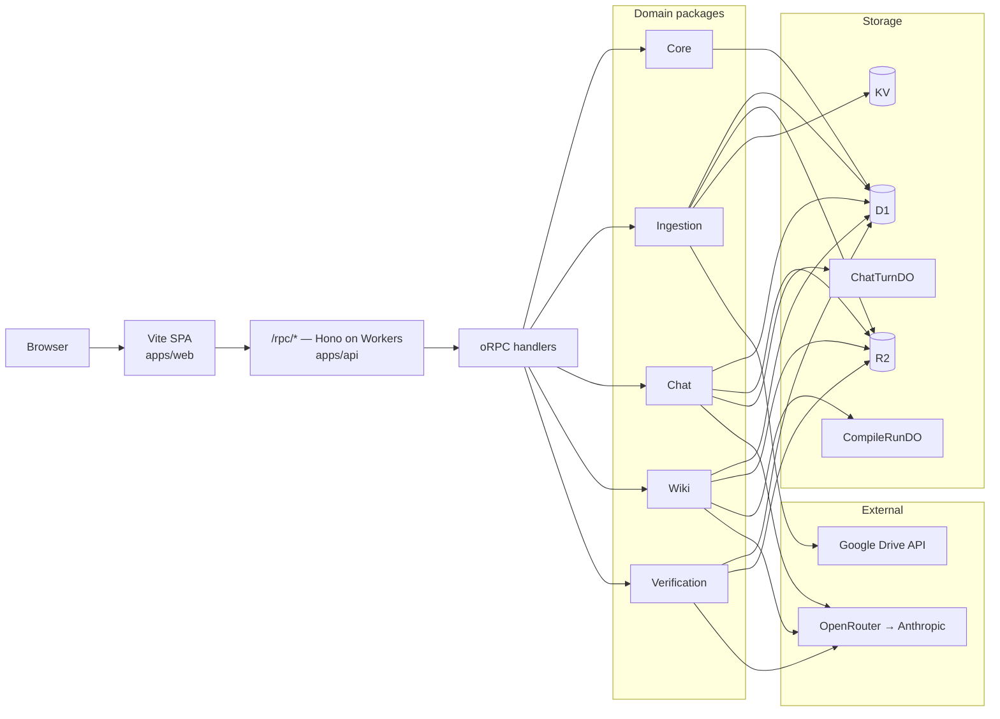

# tenex

TypeScript monorepo. Bun + Turborepo + Hono on Cloudflare Workers + Vite/React on the frontend. Domain-driven, contract-first.

The product is a **folder-grounded wiki**: point it at a Google Drive folder, the API ingests every PDF / Google Doc / Sheet / Slide / DOCX / Markdown, the compiler turns the collection into a wiki of typed pages with byte-range citations, a verification pass lints every claim against its cited span, and a chat surface answers questions over the wiki with the same span-verifying loop.

## Live demo


The app is already deployed to Cloudflare Workers — no setup required to try it:

**<https://tenex-api.tonyvantur.workers.dev>**

> **Try the seeded wiki directly:** <https://tenex-api.tonyvantur.workers.dev/wiki/cb0b020d-50ab-41cb-91d9-09a5dda547b2> — a 27-page wiki compiled from the Anthropic research bundle (Constitutional AI, many-shot jailbreaks, alignment faking).

The Worker serves both the SPA (`/*`) and the oRPC api (`/rpc/*`) from the same origin — no CORS, no separate frontend deploy. Health check: <https://tenex-api.tonyvantur.workers.dev/rpc/core/health>.

The homepage is public-by-design: any visitor reads the seeded Anthropic-research wiki without signing in. Google OAuth ingestion is the developer's compile path and stays behind a session — the OAuth client is unverified, so public sign-in isn't supported. To compile your own folder, run the api locally and follow [`docs/operations/local-dev.md`](docs/operations/local-dev.md).

## Code walkthrough — start here

The architecture docs walk through how a request flows end-to-end, with line-anchored deep links into the actual source. **Read these in order if you want to understand the system:**

1. **[`docs/architecture/talk.md`](docs/architecture/talk.md)** — a scroll-through of the whole system. Each section opens with a short plain-English context paragraph, then the diagram and the code, with a "what you're looking at" note under each block. Best entry point.
2. **[`docs/architecture/code-tour.md`](docs/architecture/code-tour.md)** — file-by-file walkthrough following a user request through the system: SPA → oRPC contract → domain interface → application use-case → infrastructure adapter → D1/R2/Drive. Same arc as the talk, with the real code.
3. **[`docs/architecture/perspective-flow.md`](docs/architecture/perspective-flow.md)** — narrower deep dive on how the user's typed "perspective" reaches every model call during a wiki compile (search-results-style intent → schema inference → page drafting → index building → verifier). Shows the one cross-cutting thread the storyboard depends on.

Supporting reference:

- [`docs/architecture/README.md`](docs/architecture/README.md) — bird's-eye architecture overview + reading order.
- [`docs/projects/folder-wiki/spec.md`](docs/projects/folder-wiki/spec.md) — the design spec we built against (data model, lifecycle, verifier protocol, lint loop).
- [`docs/projects/folder-wiki/storyboard.md`](docs/projects/folder-wiki/storyboard.md) — the three Moments the product is staged around. Every architectural decision serves one of them.
- [`docs/ubiquitous-language.md`](docs/ubiquitous-language.md) — the cross-context glossary. If a term in code seems load-bearing, it's defined here.
- [`docs/ddd/bounded-contexts.md`](docs/ddd/bounded-contexts.md) and [`docs/ddd/layering.md`](docs/ddd/layering.md) — the package-as-context discipline and the domain/application/infrastructure/interface layering rules.
- [`docs/operations/local-dev.md`](docs/operations/local-dev.md), [`docs/operations/secrets.md`](docs/operations/secrets.md), [`docs/operations/deploy.md`](docs/operations/deploy.md) — ops runbooks for when you want to run/deploy/rotate.

## Quick start

You need **bun ≥ 1.3.0** and **Node.js ≥ 22** (wrangler's local dev needs real Node — under bun's node-shim, wrangler's ProxyWorker IPC hangs).

```sh
git clone <repo>
cd tenex

bun install                                       # installs deps, runs rulesync, wires git hooks
cp apps/api/.dev.vars.example apps/api/.dev.vars  # then fill in values — see file comments
bun run dev                                       # starts api on :8787 and web on :5173
```

Open <http://localhost:5173>.

### What goes in `.dev.vars`

`apps/api/.dev.vars` is the **only** secrets file. Wrangler reads it automatically for local dev; `bun --filter @app/api run secrets:put` uploads the same values as Cloudflare Workers secrets for production. The example file documents each var inline; the four required ones are:

| Var | What it is | How to get it |
|---|---|---|
| `OAUTH_TOKEN_KEY_BASE64` | AES-GCM key encrypting Drive refresh tokens at rest in D1. | `openssl rand -base64 32` |
| `GOOGLE_OAUTH_CLIENT_ID` | Google OAuth web client for Drive ingestion. | Google Cloud Console → APIs & Services → Credentials → New OAuth client ID (Web application). |
| `GOOGLE_OAUTH_CLIENT_SECRET` | Same client's secret. | Same screen. |
| `OPEN_ROUTER_API_KEY` | Routes the wiki compiler + chat + verifier to Anthropic models. | <https://openrouter.ai/keys> |

Add `http://localhost:8787/rpc/ingestion/authCallback` to your Google OAuth client's authorized redirect URIs.

## Architecture

One Worker, one origin. The SPA talks to the api over oRPC at `/rpc/*`. The api routes into five bounded-context packages, which read and write through Cloudflare's storage primitives (D1 for typed rows, R2 for source bytes, KV for cached extracts) and two Durable Objects (one per long-running compile, one per chat turn). Drive supplies the source documents; OpenRouter fronts every model call to Anthropic.



## Layout

```
apps/
  api/                            # @app/api — Hono on Cloudflare Workers, mounts the oRPC router
  web/                            # @app/web — Vite + React + React Query, consumes contracts
packages/
  contracts/                      # @package/contracts — oRPC contract definitions (the seam)
  shared-kernel/                  # @package/shared-kernel — ids, Result, Clock — small primitives
  domains/
    <bounded-context>/            # one package per bounded context
      src/domain/                 # entities, value objects, events (framework-free)
      src/application/            # use-cases, command/query handlers (framework-free)
      src/infrastructure/         # adapters, repository implementations
      src/interface/              # oRPC procedure handlers (implement contracts)
      glossary.md                 # ubiquitous language for THIS context
      .cspell/glossary.txt        # cspell dictionary for THIS context
  tooling/
    biome/                        # @tooling/biome — shared biome config
    tsconfig/                     # @tooling/tsconfig — shared TS configs
docs/                             # architecture, ops runbooks, ADRs, how-tos
```

There are five bounded contexts under `packages/domains/`: `core`, `ingestion`, `wiki`, `chat`, `verification`.

## Commands

| Goal | Command |
|---|---|
| Install deps | `bun install` |
| Start everything (web + api) | `bun run dev` |
| Start only api | `bun --filter @app/api dev` |
| Start only web | `bun --filter @app/web dev` |
| Run all checks (lint + spell + typecheck + test) | `bun run check` |
| Auto-fix lint + format | `bun run fix` |
| Type-check only | `bun run typecheck` |
| Tests only | `bun run test` |
| Deploy to Cloudflare | `bun run deploy` |
| Push prod Worker secrets from `.dev.vars` | `bun --filter @app/api run secrets:put` |
| Regenerate AI rule files | `bun run rulesync` |
| Clean caches | `bun run clean` |

## Conventions

- **One package per bounded context.** Turborepo's package boundary IS the DDD context boundary; cross-context imports go through `@package/contracts` (sync) or domain events through `@package/shared-kernel` (async). `domains/X` cannot import from `domains/Y`.
- **Contract-first.** Procedures are defined in `packages/contracts`, implemented in each domain's `interface/`. Frontend imports only from `@package/contracts`.
- **`domain/` and `application/` are framework-free.** No Hono, oRPC, Cloudflare types, or React. Dependencies pass through interfaces (`Clock`, `Repo`, etc.).
- **Linguistic DDD.** Each context has its own `glossary.md` and cspell dictionary with `addWords: false` — adding a new term requires a glossary edit in the same PR.

## Deploy

Once you've authored `.dev.vars` and run `bun run check`:

```sh
bun run deploy
```

The `scripts/deploy` orchestrator auto-provisions D1 / KV / R2 if their IDs in `wrangler.toml` are still placeholders, applies every D1 migration to the remote prod database, uploads `.dev.vars` to Worker secrets, builds the SPA, and ships the Worker (which serves both `/rpc/*` and the static SPA bundle). Full walkthrough: [`docs/operations/deploy.md`](docs/operations/deploy.md).

Cloudflare login is one-time and runs interactively: `bunx wrangler login` if you haven't already.

## Troubleshooting

| Symptom | Cause | Fix |
|---|---|---|
| `apps/api/.dev.vars not found` on `bun run dev` | Step skipped after install | `cp apps/api/.dev.vars.example apps/api/.dev.vars` and fill in values |
| Wrangler dev prints "Ready on …" but HTTP requests hang | Bun's node-shim took over `node` for the wrangler subprocess | Make sure `node --version` is `v22.x`. If you use nvm, run `nvm use 22` in this shell. `apps/api/scripts/dev` strips the bun-shim from PATH but only fires if you go through `bun run dev`. |
| `OAUTH_TOKEN_KEY_BASE64 is required` at runtime | Missing or empty in `.dev.vars` | Set with `openssl rand -base64 32`. |
| `cspell: Unknown word (X)` | Term not in a context glossary | Add the bare word to the relevant `packages/domains/<ctx>/.cspell/glossary.txt` AND its `glossary.md` (no `addWords` shortcut). |
| Port 8787 or 5173 in use | A previous dev server didn't shut down | `lsof -i :8787` then `kill <pid>`. |

## Design tradeoffs (what we did and didn't build)

We made three deliberate scope choices that are worth calling out so reviewers don't read the gaps as oversight.

### We indexed by typed *perspectives*, not by embeddings

The interesting bet in this take-home is the *wiki*: an LLM-compiled, span-cited, lint-verified knowledge structure over a folder. The retrieval mechanic that powers chat is a secondary concern — once the wiki exists, search-quality improvements stack on top of it cleanly.

So the chat agent's research loop today is a tool-using loop over the wiki itself: page-type search, browse-by-section, and source-text fallback, all running against D1 + R2 with byte-range citations the synth verifier can re-hash. No vector store. No embedding model. Token-overlap scoring and the typed page schema do the work.

**Given more time, we would have added an embeddings + vector-store layer** (Cloudflare Vectorize or pgvector-on-D1) underneath the existing `WikiReader` port. Two things land for free:
- **Better recall on chat search.** "Deceptive AI behavior" matches a page titled "Alignment faking" even when the keywords don't overlap.
- **Better source-discovery fallback.** The `searchSources` path in `packages/domains/chat/src/infrastructure/d1-wiki-reader.ts` is the natural seam — swap token-overlap for a `top-k` similarity query against pre-computed chunk embeddings.

The architecture is set up for this: `WikiReader` is an interface, the composition root in `apps/api/src/build-chat-context.ts` picks the implementation, and the citation/lint contract (`SourceHashVerifier`) is agnostic to how candidate pages are surfaced. Adding the vector path is additive — it doesn't change the wiki schema, the synthesizer, or the verifier.

### Ingestion is an extension point — six formats today

The ingestion pipeline supports six source formats out of the box (`packages/domains/ingestion/src/infrastructure/`): PDF, Google Doc, Google Sheet, Google Slide, Word (`.docx`), and plain Markdown (`.md`). Each is a self-contained `Extractor` adapter; image-with-OCR, audio transcripts, and structured CSV/JSON are deliberately out of scope — not because they're hard, but because file-format handling is orthogonal to the wiki's core thesis.

The architecture makes adding the next format trivial:
- Each format is its own `Extractor` adapter in `packages/domains/ingestion/src/infrastructure/` — see `pdf-extractor.ts` (via `unpdf`), `google-doc-extractor.ts`, `google-sheet-extractor.ts`, `google-slide-extractor.ts`, `docx-extractor.ts` (via `mammoth`), `markdown-extractor.ts`.
- A new format = a new file in that directory + one line in the `extractors` registry inside `buildIngestionContext` in `apps/api/src/index.ts`, plus the MIME string in the `SourceMime` union (`packages/contracts/src/ingestion/sources.ts` + `packages/domains/ingestion/src/domain/manifest.ts`). The wiki compile, the chat agent, the verifier, and the SPA see nothing new.
- The `Manifest` value object in the ingestion domain carries `mime` + raw bytes — every downstream stage works in terms of the extracted text, not the source format.

**Given more time we would have added:** images via VLM captioning (Sonnet 4.6 vision → text), audio transcripts (Whisper), structured CSV/JSON, and HTML. Each is a self-contained Extractor; none requires changes outside `packages/domains/ingestion/`.

The choice was: prove the wiki concept end-to-end across a tight set of well-understood formats, rather than spread engineering thin across every format with a thinner wiki on top.

### Observability via OTel; Langfuse-ready

Every LanguageModel call and top-level use-case (`compile.run`, `compile.synthesis.page`, `chat.turn`, `chat.tool.{searchWiki,searchSources,readWikiPage,listPagesByType}`, `lint.run`, and per-call `llm.call` spans) emits an OpenTelemetry span. Attributes follow OTel's GenAI semantic conventions — `gen_ai.system`, `gen_ai.request.model`, `gen_ai.usage.input_tokens`, `gen_ai.usage.output_tokens` — so any GenAI-aware backend picks up cost and token attribution automatically. Prompts and completions are truncated to 500 chars in the span; full text would be too noisy at this granularity.

Default in dev: `ConsoleTracer` writes one structured JSON line per finished span to stdout. Run `bun run dev` and watch wrangler logs — every span is visible without any external setup.

Switch to Langfuse with three env vars in `apps/api/.dev.vars`:

```
LANGFUSE_HOST=https://cloud.langfuse.com
LANGFUSE_PUBLIC_KEY=pk-lf-…
LANGFUSE_SECRET_KEY=sk-lf-…
```

The OTLP/HTTP exporter (in `packages/shared-kernel/src/observability/otlp-http-exporter.ts`) derives `${LANGFUSE_HOST}/api/public/otel/v1/traces` and an `Authorization: Basic base64(pk:sk)` header automatically. No code change, no SDK bundle in the Worker — the exporter speaks the OTLP/HTTP-JSON wire format directly against Workers' `fetch`. Generic OTLP backends work the same way via `OTEL_EXPORTER_OTLP_ENDPOINT` + `OTEL_EXPORTER_OTLP_HEADERS` (Honeycomb, Grafana Cloud, Tempo, etc.).

What we deliberately did NOT do: a prompt-management plane (versioning, A/B variants), an evals dashboard wired into CI. The `LanguageModel` port is the seam those would plug into — we chose observability because it answers "is the system behaving in prod?" today rather than "are prompts improving over weeks?" That's the right ordering for a system this early.

## Evals

A span-citation accuracy harness against the anthropic-papers case set lives in [`evals/`](evals/README.md); run with `bun run evals`.

What's covered:

- **Span-citation accuracy** — case set in `evals/anthropic-papers-cases.ts`: questions paired with expected source spans across the Constitutional AI / many-shot jailbreaks / alignment-faking bundle.
- **Citation roundtrip** — `bun run evals:citation-roundtrip` proves every citation's `contentHash` matches the live source bytes (hash invariant check against the deployed api).

## AI tooling

This repo is set up to work with both **Claude Code** and **Codex**. Source of truth lives in `.rulesync/`; `bun install` runs `rulesync generate` via postinstall, fanning the rules out to `CLAUDE.md`, `AGENTS.md`, `.claude/`, `.codex/`, and `.agents/` (all gitignored). Skills live in `skills/<name>/SKILL.md` and are symlinked into both `.claude/skills/` and `.codex/skills/`.

## Screens

Screenshots captured against the live Worker at <https://tenex-api.tonyvantur.workers.dev> (1440×900).


*Homepage. Hero copy plus the featured "Anthropic research bundle" wiki — 27 typed pages compiled from a Drive folder of Anthropic alignment papers.*


*Wiki overview. Left rail is the typed table of contents (Risks, Opportunities, Wedges, Concepts); the body lists every Concept page with its glossary blurb. Page-type chips are the closed enum the schema-inference pass settled on.*


*Concept page. Magazine layout: prose on the left, citation chips and last-verified timestamp on the right. Every claim links to a byte-range Span in its cited source.*


*Lint dashboard. "Run audit" replays every Claim against its cited Span via the Opus 4.7 verifier, surfaces failures inline with a suggested correction, and lets you apply the fix from the page.*


*Chat dock. Cmd+K from any wiki route opens the right-side dock; the chat agent uses page-type search, browse-by-section, and source-text fallback over the wiki — every answer cites the Span the verifier can re-hash.*


*Compile theater. Live SSE narration of an in-progress Compile Run: schema reveal, source cards flying through extraction, emerging typed pages, and a per-agent thought stream.*

## Docs

The full knowledge base lives at [`docs/`](docs/README.md) — architecture overview, DDD rules, stack reference, ops runbooks, ADRs, how-to guides. Start there if you want to go deeper.
