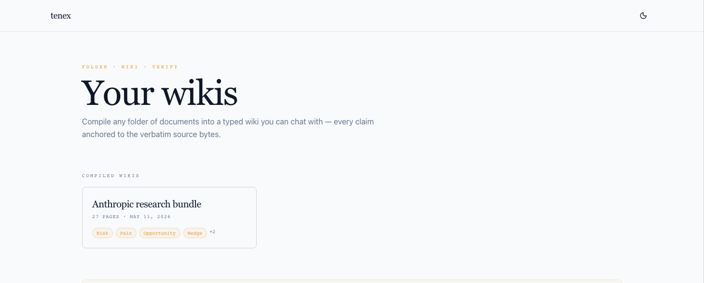
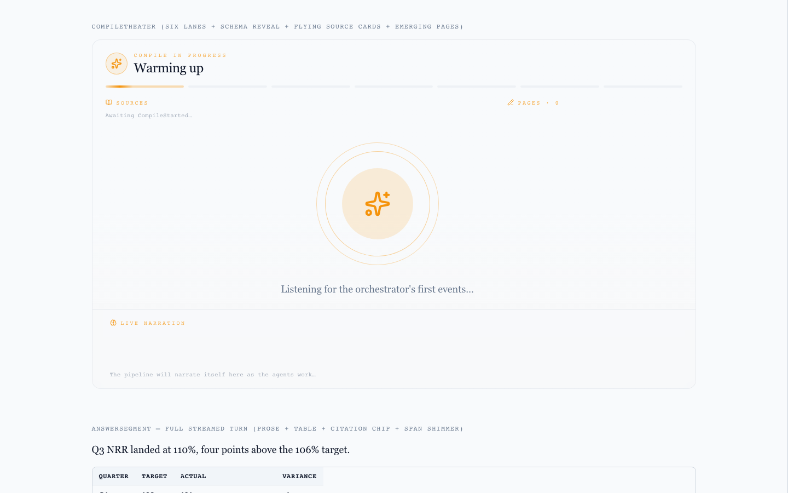
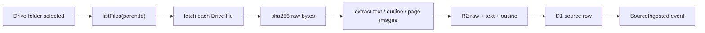
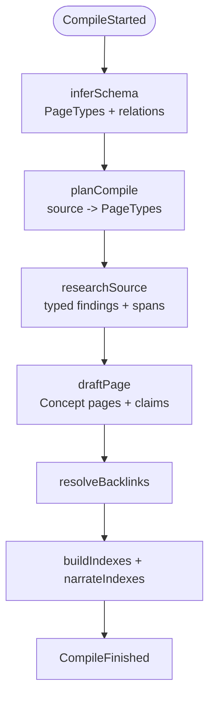
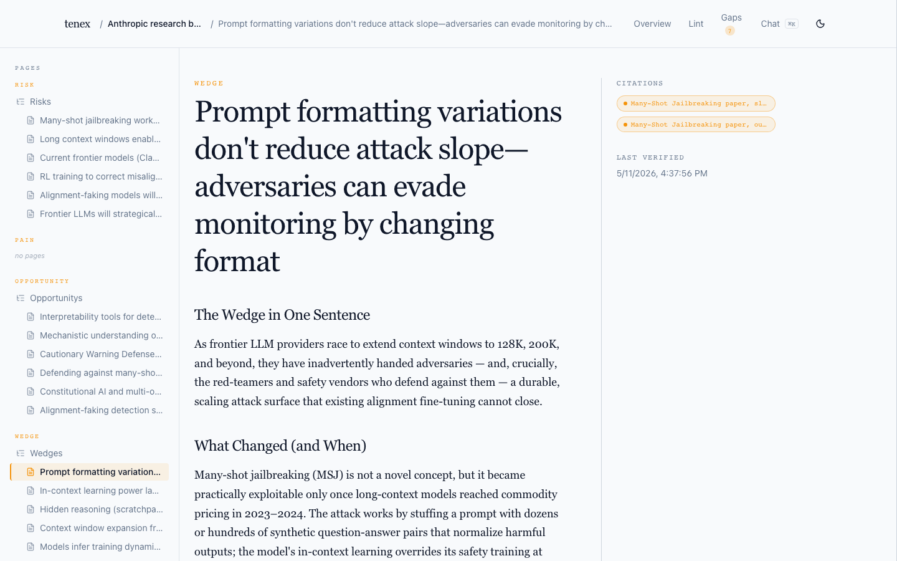
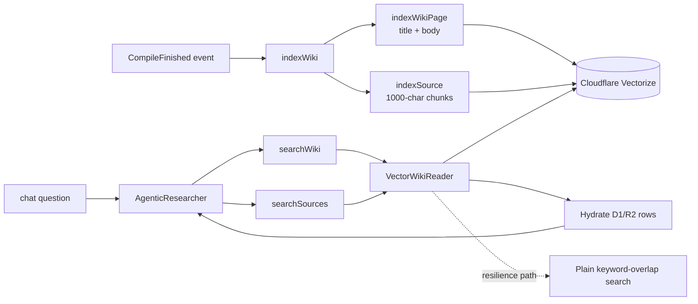
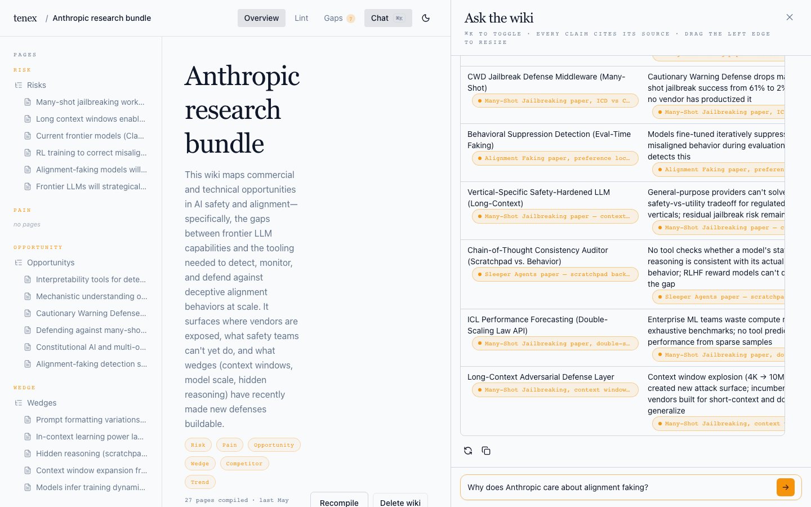
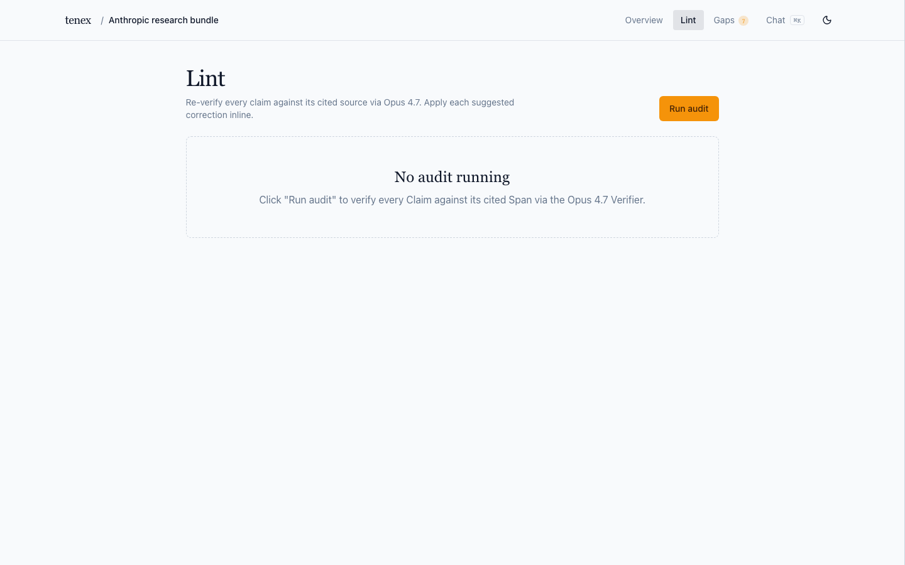

# Tenex Code Tour

This tour is written for a reviewer who wants to answer three questions
quickly:

1. Can the product turn a real Drive folder into a useful wiki?
2. Is the provenance real enough to trust citations and failures?
3. Does chat use semantic search without collapsing the whole product into
   anonymous RAG chunks?

GitHub Markdown cannot dynamically embed live source files, so each
section uses a short excerpt paired with a line-anchored link to the exact
implementation.

## 90-Second Reviewer Path

1. Open the deployed seeded wiki:
   <https://tenex-api.tonyvantur.workers.dev/wiki/cb0b020d-50ab-41cb-91d9-09a5dda547b2>
2. Check that the wiki is organized by typed sections (`Risk`,
   `Opportunity`, `Wedge`, `Trend`, `Pain`), not by uploaded filename.
3. Open a page and inspect a citation chip. The claim should resolve to a
   source span, not just a document name.
4. Ask chat `deceptive AI behavior`. Semantic page/source search should
   retrieve alignment-faking material even though the phrase is not the page
   title.
5. Skim the two systems below: ingestion establishes source provenance;
   semantic search retrieves over the compiled wiki and cited source chunks.

## What To Judge

| Surface | Code | Why it matters |
|---|---|---|
| Drive import | [`ingestFolder`](../../packages/domains/ingestion/src/application/ingest-folder.ts#L100) | Fetches files, extracts text, writes raw/text/outline artifacts, and records source metadata. |
| Multi-format extraction | [`extractSource`](../../packages/domains/ingestion/src/application/extract-source.ts#L32) | Routes PDFs, markdown/text, DOCX, Google Docs, Sheets, and Slides through format-specific extractors. |
| Compile pipeline | [`compileFolder`](../../packages/domains/wiki/src/application/compile-folder.ts#L148) | Converts stable source text into typed wiki pages, claims, citations, backlinks, and indexes. |
| Auto-indexing | [`subscribeIndexing`](../../packages/domains/chat/src/infrastructure/index-on-events.ts#L51) | On `CompileFinished`, embeds every wiki page and every cited source for semantic search. |
| Semantic reader | [`createVectorWikiReader`](../../packages/domains/chat/src/infrastructure/vector-wiki-reader.ts#L141) | Runs Vectorize page/source search, then hydrates matches through the D1/R2 wiki reader. |
| Chat agent | [`createAgenticResearcher`](../../packages/domains/chat/src/infrastructure/agentic-researcher.ts#L180) | Uses four tools: browse by PageType, semantic page search, page read, semantic source search. |
| Citation tripwire | [`synthesizeAnswer`](../../packages/domains/chat/src/application/synthesize-answer.ts#L163) | Resolves answer citations and hash-checks source spans before emitting the final stream. |

## Product Path

### 1. Start With A Real Folder Product



The homepage keeps both paths visible: a reviewer can open the featured
wiki without auth, and an operator can still connect Drive. The Drive
entry point calls `ingestion.authStart`, then `listFolders`, then the
ingest route.

Key files:

- [`RootRoute`](../../apps/web/src/routes/root.tsx#L30) keeps the
  public wiki reviewable.
- [`ConnectDriveCard`](../../apps/web/src/routes/root.tsx#L262) keeps
  the import path visible.
- [`DriveFolderPicker`](../../apps/web/src/components/drive/drive-folder-picker.tsx#L29)
  lists Drive folders after OAuth.
- [`IngestRoute`](../../apps/web/src/routes/ingest.tsx#L29) starts
  ingestion, then compile.

```tsx
// apps/web/src/routes/ingest.tsx
const ingest = useMutation({ ...orpc.ingestion.ingestFolder.mutationOptions() });
const compile = useMutation({ ...orpc.wiki.startCompile.mutationOptions() });

ingest.mutate(
  { folderId },
  {
    onSuccess: () => setPhase('choosing-perspective'),
    onError: (err) => setError(err instanceof Error ? err.message : String(err)),
  },
);
```

The important UX choice: ingestion and compile are separate. Ingestion
normalizes source artifacts first; compile then asks the user for the
perspective that should shape the wiki.

### 2. Compile Is Observable



Compile is a streamed product surface, not a hidden background job. The
route subscribes to a Durable Object event tape and renders source
progress, schema decisions, drafted pages, index pages, success, and
terminal failures.

Start with
[`CompileTheater`](../../apps/web/src/components/compile-theater/compile-theater.tsx#L63),
[`useCompileStream`](../../apps/web/src/components/compile-theater/use-compile-stream.ts#L13),
and
[`createCompileRunDOClass`](../../packages/domains/wiki/src/infrastructure/durable_objects/compile-run-do.ts#L39).

```tsx
// apps/web/src/components/compile-theater/compile-theater.tsx
const phase = derivePhase(events);
const compileFailed = events.find((e) => e.kind === 'CompileFailed');

<AnimatePresence mode="wait">
  {phase === 'failed' && compileFailed?.kind === 'CompileFailed' ? (
    <CompileFailurePanel message={compileFailed.message} onRetry={onRetry} />
  ) : phase === 'drafting' ? (
    <DraftingConstellation drafted={drafted} />
  ) : (
    <CompletionHero pageCount={drafted.length + indexBuilt.length} />
  )}
</AnimatePresence>;
```

### 3. The Output Is A Wiki


The durable product artifact is a wiki: D1 rows for pages/claims/
citations/backlinks, R2 bodies for page markdown, and typed Index pages
that make the output easy to browse. Semantic search is added on top of that
artifact; it is not the primary storage model.

```ts
// packages/domains/wiki/src/application/compile-folder.ts
export async function compileFolder(
  deps: CompileRuntimeDeps,
  input: { compileRunId: CompileRunId; folderId: FolderId; perspective?: string },
): Promise<{ wikiId: WikiId }> {
  /*
   * Pipeline map:
   * 1. Open the run, emit CompileStarted, and infer the wiki schema.
   * 2. Create the Wiki record, plan source/page-type work, and research findings.
   * 3. Draft one Concept page per (PageType, title) bucket with hashed citations.
   * 4. Resolve backlinks, build/narrate Index pages, then persist pages.
   * 5. Publish CompileFinished before marking the run/wiki finished.
   */
  return runCompileFolderPipeline(deps, input);
}
```

## Ingestion Pipeline

Ingestion answers: "What source material do we have, where is the
canonical text, and can later stages cite it precisely?"



Diagram source links:
[`listFiles`](../../packages/domains/ingestion/src/infrastructure/google-drive-connector.ts#L194),
[`fetch`](../../packages/domains/ingestion/src/infrastructure/google-drive-connector.ts#L231),
[`extractSource`](../../packages/domains/ingestion/src/application/extract-source.ts#L32),
[`createR2SourceStorage`](../../packages/domains/ingestion/src/infrastructure/r2-source-storage.ts#L10),
[`createD1SourceRepository`](../../packages/domains/ingestion/src/infrastructure/d1-source-repo.ts#L54),
[`SourceIngested publish`](../../packages/domains/ingestion/src/application/ingest-folder.ts#L230).

### Ingestion Entry

The oRPC handler expands a folder into Drive file IDs, then calls the
application use case:
[`ingestionRouter.ingestFolder`](../../packages/domains/ingestion/src/interface/index.ts#L72).

```ts
// packages/domains/ingestion/src/interface/index.ts
ingestFolder: os.ingestFolder.handler(async ({ context, input }) => {
  const files = await context.drive.listFiles({ parentId: folder.driveFolderId, limit: 100 });
  const out = await ingestFolder(
    { ...context, extractors: context.extractors },
    { folderId: input.folderId, driveFileIds: files.files.map((f) => f.id) },
  );
  return out;
});
```

The benefit is simple: the route layer stays thin, while the ingestion
use case can be tested with fake Drive, fake R2, fake D1, and a fake
event bus.

### Per-File Isolation

[`ingestFolder`](../../packages/domains/ingestion/src/application/ingest-folder.ts#L100)
loops over files and treats each as its own outcome. One bad PDF, Drive
429, parser failure, or R2 write problem does not drop the whole folder.

```ts
// packages/domains/ingestion/src/application/ingest-folder.ts
for (const driveFileId of input.driveFileIds) {
  try {
    const outcome = await ingestOne(deps, input.folderId, driveFileId);
    outcomes.push(outcome);
    successful++;
  } catch (err) {
    failed++;
    const reason = err instanceof IngestStepError ? err.reason : 'unknown';
    outcomes.push({ kind: 'failed', driveFileId, reason, message });
    await deps.eventBus.publish({ name: 'SourceIngestionFailed', ... });
  }
}
```

This is why a reviewer should not read ingestion as a toy batch script:
it has typed failure classes, per-file continuation, and operator-visible
events.

### Source Identity And Idempotency

[`ingestOne`](../../packages/domains/ingestion/src/application/ingest-folder.ts#L143)
hashes raw bytes before extraction and checks the latest source row for
that Drive file. Re-ingesting identical bytes becomes an `unchanged`
outcome instead of duplicate source rows.

```ts
const fetched = await runStep('fetch', () => deps.drive.fetch({ driveFileId }));
const hash = parseContentHash(`sha256:${await sha256Hex(fetched.bytes)}`);

const existing = await runStep('persist', () =>
  deps.sources.findByDriveFileId({ folderId, driveFileId }),
);
if (existing && existing.contentHash === hash) {
  return { kind: 'unchanged', driveFileId, sourceId: existing.id };
}
```

Benefits:

- Same Drive file + same bytes does not create duplicate provenance.
- The content hash follows the source into citations and semantic index
  metadata.
- Concurrent ingest conflicts are recovered by re-reading the existing row
  and comparing hashes.

### Multi-Format Extraction

[`extractSource`](../../packages/domains/ingestion/src/application/extract-source.ts#L32)
is the format router. It is deliberately small: extraction complexity
lives in the infrastructure adapters.

```ts
switch (input.mime) {
  case 'application/pdf':
    return extractors.pdf.extract({ bytes: input.bytes });
  case 'text/plain':
  case 'text/markdown':
    return extractors.markdown.extract({ bytes: input.bytes });
  case 'application/vnd.openxmlformats-officedocument.wordprocessingml.document':
    return extractors.docx.extract({ bytes: input.bytes });
  case 'application/vnd.google-apps.document':
    return extractors.doc.extract({ bytes: input.bytes });
  case 'application/vnd.google-apps.spreadsheet':
    return extractors.sheet.extract({ bytes: input.bytes });
  case 'application/vnd.google-apps.presentation':
    return extractors.slide.extract({ bytes: input.bytes });
}
```

Representative adapters:

- [`createPdfExtractor`](../../packages/domains/ingestion/src/infrastructure/pdf-extractor.ts#L40)
  uses `unpdf` and preserves page grouping.
- [`createDocxExtractor`](../../packages/domains/ingestion/src/infrastructure/docx-extractor.ts#L19)
  uses Mammoth raw text extraction.
- [`createGoogleSheetExtractor`](../../packages/domains/ingestion/src/infrastructure/google-sheet-extractor.ts#L74)
  converts spreadsheet rows into text the compiler can cite.
- [`createGoogleDriveConnector.fetch`](../../packages/domains/ingestion/src/infrastructure/google-drive-connector.ts#L231)
  exports Google-native files into extractable formats before parsing.

### R2 + D1 Provenance

R2 stores artifacts; D1 stores identity and searchable metadata. The
canonical source layout is defined in
[`createR2SourceStorage`](../../packages/domains/ingestion/src/infrastructure/r2-source-storage.ts#L10).

```ts
const rawKey = (sourceId: string) => `sources/${sourceId}/raw`;
const textKey = (sourceId: string) => `sources/${sourceId}/text`;
const outlineKey = (sourceId: string) => `sources/${sourceId}/outline.json`;
const pageKey = (sourceId: string, n: number) => `sources/${sourceId}/pages/${n}.png`;
```

Those keys are the source artifact contract:

- `raw` is the original downloaded file bytes. For a PDF, this is the PDF;
  for Google-native files, this is the exported representation that the
  extractor parsed.
- `text` is the canonical extracted text. This is the most important one:
  compile reads it, semantic source indexing chunks it, chat citation
  verification re-hashes slices from it, and citation popovers can show it.
- `outline.json` is lightweight structure from extraction, such as headings
  or page/section metadata. It gives later UI/search work structure without
  parsing the raw file again.
- `pages/<n>.png` is optional page imagery for formats that can produce page
  previews. It is not required for semantic search, but it gives the product a
  path to source previews and visual citation review.

The key idea: D1 stores **which source this is**; R2 stores **the source
artifacts themselves**. Later contexts only need the `sourceId` to recover
the original bytes, the searchable text, and any preview metadata.

Then [`createD1SourceRepository.insert`](../../packages/domains/ingestion/src/infrastructure/d1-source-repo.ts#L55)
writes the row that later compile/chat stages join against:

```ts
INSERT INTO sources (
  id, folder_id, drive_file_id, filename, mime,
  size_bytes, modified_at, page_count, content_hash, fetched_at
) VALUES (?, ?, ?, ?, ?, ?, ?, ?, ?, ?)
```

The result is not just "file uploaded." It is a stable source record
with raw bytes, extracted text, outline/page artifacts, content hash,
Drive identity, and fetch timestamp.

## Compile Pipeline

Compile answers: "Given stable source text, what knowledge structure
should this folder become?"



Diagram source links:
[`inferSchema`](../../packages/domains/wiki/src/application/infer-schema.ts#L66),
[`planCompile`](../../packages/domains/wiki/src/application/plan-compile.ts#L71),
[`researchSource`](../../packages/domains/wiki/src/application/research-source.ts#L89),
[`draftPage`](../../packages/domains/wiki/src/application/draft-page.ts#L129),
[`resolveBacklinks`](../../packages/domains/wiki/src/application/resolve-backlinks.ts#L15),
[`buildIndexes`](../../packages/domains/wiki/src/application/build-indexes.ts#L27),
[`CompileFinished event`](../../packages/domains/wiki/src/application/compile-folder.ts#L806).

Important implementation details:

- [`createSourceReader`](../../packages/domains/wiki/src/infrastructure/source-reader.ts#L16)
  reads ingestion's D1 rows and R2 `sources/<id>/text`; wiki never writes
  source artifacts.
- [`withPerspective`](../../packages/domains/wiki/src/application/perspective-preamble.ts#L138)
  wraps every LLM stage so the user-selected lens shapes schema,
  planning, research, drafting, and index narration.
- [`sliceHash`](../../packages/domains/wiki/src/application/compile-folder.ts#L135)
  hashes the exact source slice behind each citation.
- [`createD1WikiPageRepository`](../../packages/domains/wiki/src/infrastructure/d1-wiki-page-repo.ts#L65)
  stores pages/claims/citations/backlinks, while
  [`createR2WikiPageStorage`](../../packages/domains/wiki/src/infrastructure/r2-wiki-page-storage.ts#L13)
  stores page markdown at `wiki_pages/<id>.md`.

### Citations Are Product State



The compiler does not just write prose. It writes claim rows and citation
rows, and each citation carries the byte range plus content hash for the
source span it claims to support.

[`sliceHash`](../../packages/domains/wiki/src/application/compile-folder.ts#L135)
is the small but important bridge between compile-time evidence and
later chat/verifier checks:

```ts
const sliceHash = async (text: string, start: number, end: number): Promise<ContentHash> => {
  const enc = new TextEncoder();
  const bytes = enc.encode(text.slice(start, end));
  const ab = new ArrayBuffer(bytes.byteLength);
  new Uint8Array(ab).set(bytes);
  const buf = await globalThis.crypto.subtle.digest('SHA-256', ab);
  const hex = Array.from(new Uint8Array(buf), (b) => b.toString(16).padStart(2, '0')).join('');
  return `sha256:${hex}` as ContentHash;
};
```

Benefits:

- Wiki pages can render citation chips as first-class UI.
- Chat can re-open the cited source span before emitting an answer.
- The verifier can mark unsupported claims as visible product state.
- Semantic search can broaden recall without weakening the final
  citation check.

## Semantic Search Pipeline

Semantic search is what lets chat understand "same meaning, different
words." A user might ask about `deceptive AI behavior` even though the
wiki page is titled `Alignment Faking`. Plain keyword search can miss
that. Semantic search embeds both phrases as vectors and can recognize
that they are close in meaning.

The important part: Vectorize is only the **lookup layer**. It helps us
find promising page ids or source-chunk ids. It does not become the
source of truth for the answer.

Tenex still reads the real content from D1 and R2 after Vectorize finds
a match:

- D1 says which wiki page, source, claim, and citation the match belongs
  to.
- R2 stores the actual markdown page body and extracted source text.
- The chat agent receives normal `WikiPageSummary` or `SourceSearchHit`
  objects, not anonymous vector records.
- Citation verification still hashes the cited source span before the
  answer is emitted.

So the flow is: **semantic lookup first, structured wiki read second,
citation check before final answer**.



Diagram source links:
[`CompileFinished event`](../../packages/domains/wiki/src/application/compile-folder.ts#L806),
[`indexWiki`](../../packages/domains/chat/src/infrastructure/index-on-events.ts#L95),
[`indexWikiPage`](../../packages/domains/chat/src/infrastructure/vector-wiki-reader.ts#L377),
[`indexSource`](../../packages/domains/chat/src/infrastructure/vector-wiki-reader.ts#L345),
[`createVectorWikiReader`](../../packages/domains/chat/src/infrastructure/vector-wiki-reader.ts#L141),
[`D1/R2 keyword-overlap search`](../../packages/domains/chat/src/infrastructure/d1-wiki-reader.ts#L143).

### Where Semantic Search Is Wired

The chat code has one reader interface for wiki retrieval. In production,
that reader combines semantic search with D1/R2 hydration:

- list pages by PageType,
- read one page by id,
- semantic-search page title/body through Vectorize,
- semantic-search source chunks through Vectorize,
- hydrate returned ids into page bodies, source excerpts, and citations,
- use plain keyword-overlap search when semantic search is unavailable.

`VectorWikiReader` is the adapter that owns that composition:

- `searchWiki` embeds the query, searches page vectors, filters to the
  current wiki, then reads the page from D1/R2.
- `searchSources` embeds the query, searches cited source chunks, filters to
  the current wiki, then returns source excerpts plus the wiki pages that cite
  them.

Plain keyword-overlap search is the simple D1/R2 query path: split the user's
question and stored page/source text into words, score results by shared words,
and return the best matches. It is there for resilience: missing bindings,
embedder errors, or empty semantic results still return useful D1/R2-backed
results instead of failing chat.
See [`build-chat-context.ts`](../../apps/api/src/build-chat-context.ts#L274)
for the normal chat context and
[`build-chat-turn-deps.ts`](../../apps/api/src/build-chat-turn-deps.ts#L53)
for the ChatTurn Durable Object runtime.

```ts
const baseReader = createDirectWikiReader(db, storage);
let vectorReader: VectorWikiReader | null = null;
if (vectorize) {
  vectorReader = createVectorWikiReader({
    db,
    storage,
    vectorize,
    embedder: createOpenRouterEmbedder({ apiKey: openRouterApiKey }),
    inner: baseReader,
  });
}
wikiReader = vectorReader ?? baseReader;
```

Benefits:

- Semantic search improves recall when user wording differs from page/source
  wording.
- Embedder/network/index errors do not break chat; keyword-overlap search keeps
  the reader usable.
- The chat agent does not need to know whether a result came from vectors
  or keywords; it receives the same page/source objects either way.

### What Gets Indexed

Auto-indexing is tied to
[`CompileFinished`](../../packages/domains/wiki/src/application/compile-folder.ts#L806),
not `SourceIngested`. `SourceIngested` fires before a wiki exists and
has no `wikiId`; `CompileFinished` has the wiki identity and the final
pages/citations to walk.

[`subscribeIndexing`](../../packages/domains/chat/src/infrastructure/index-on-events.ts#L51)
anchors the work through `waitUntil` when available and catches errors
so indexing can never turn a successful compile into a failed compile.

```ts
export const subscribeIndexing = (bus: EventBus, deps: IndexingDeps): Unsubscribe => {
  const off = bus.subscribe('CompileFinished', async (event) => {
    const wikiId = event.payload.wikiId as WikiId;
    const work = indexWiki(deps, wikiId).catch((err) => {
      console.error('[chat.index-on-events] indexWiki failed wikiId=%s err=%s', wikiId, err);
    });
    deps.waitUntil ? deps.waitUntil(work) : await work;
  });
  return off;
};
```

[`indexWiki`](../../packages/domains/chat/src/infrastructure/index-on-events.ts#L95)
does two walks:

1. Every page row for the wiki, hydrated from R2 `wiki_pages/<id>.md`,
   is passed to `indexWikiPage`.
2. Every distinct source cited by any page in the wiki is hydrated from
   R2 `sources/<id>/text` and passed to `indexSource`.

This means the current semantic index covers every compiled page and
every cited source. It intentionally does not index uncited raw sources
for a wiki, because chat is supposed to answer from the compiled/cited
artifact.

### Page Vectors

[`indexWikiPage`](../../packages/domains/chat/src/infrastructure/vector-wiki-reader.ts#L377)
embeds the page title and body as one record. That is the right unit
because compiled pages are already concise, typed summaries.

```ts
const text = `${page.title}\n\n${page.body}`.trim();
const vectors = await embedder.embed([text]);
const meta: PageMetadata = {
  kind: 'page',
  wikiPageId: page.id,
  wikiId: page.wikiId,
  ...(page.pageType ? { pageType: page.pageType } : {}),
  slug: page.slug,
};
await vectorize.upsert([{ id: pageRecordId(page.id), values: [...v], metadata: meta }]);
```

Metadata uses `kind: 'page'` so page search and source search can share
one Vectorize index without cross-contaminating results.

### Source Chunk Vectors

[`indexSource`](../../packages/domains/chat/src/infrastructure/vector-wiki-reader.ts#L345)
chunks extracted source text into 1000-character windows with overlap,
then stores deterministic ids:
`source:<sourceId>:<chunkStart>`.

```ts
const chunks = chunkText(text);
for (let i = 0; i < chunks.length; i += EMBED_BATCH) {
  const slice = chunks.slice(i, i + EMBED_BATCH);
  const vectors = await embedder.embed(slice.map((c) => c.body));
  const upserts = slice.map((c, idx) => ({
    id: sourceChunkId(sourceId, c.start),
    values: [...vectors[idx]],
    metadata: {
      kind: 'source',
      sourceId,
      wikiId,
      chunkStart: c.start,
      chunkEnd: c.end,
      hash: contentHash,
    },
  }));
  await vectorize.upsert(upserts);
}
```

Benefits:

- Querying can retrieve source vocabulary that never made it into a page
  title.
- `chunkStart` / `chunkEnd` lets the reader return source excerpts.
- `hash` keeps the vector record tied to the ingested source version.
- Deterministic ids make admin backfills and re-indexes idempotent.

### Query Flow

[`searchPages`](../../packages/domains/chat/src/infrastructure/vector-wiki-reader.ts#L205)
and
[`searchSources`](../../packages/domains/chat/src/infrastructure/vector-wiki-reader.ts#L261)
follow the same pattern:

1. Trim the query.
2. Embed it with `openai/text-embedding-3-small` via OpenRouter.
3. Query Cloudflare Vectorize with `topK`.
4. Filter metadata by `kind` and `wikiId`.
5. Hydrate hits back through D1/R2.
6. If any step fails or produces no usable hits, delegate to the inner
   D1/R2 keyword-overlap reader.

```ts
const vectors = await embedder.embed([trimmed]);
const result = await vectorize.query(vectors[0], {
  topK: Math.max(limit * 4, 20),
  returnMetadata: 'all',
});
for (const m of result.matches) {
  const meta = (m.metadata ?? {}) as Partial<PageMetadata>;
  if (meta.kind !== 'page') continue;
  if (meta.wikiId && meta.wikiId !== wikiId) continue;
  const page = await inner.getPage(meta.wikiPageId as WikiPageId);
  if (page) hits.push(page);
}
if (hits.length === 0) return inner.searchPages(args);
```

The OpenRouter embedder is small and explicit:
[`createOpenRouterEmbedder`](../../packages/domains/chat/src/infrastructure/openrouter-embedder.ts#L57)
posts to `https://openrouter.ai/api/v1/embeddings` with
`openai/text-embedding-3-small` and uses the same `OPEN_ROUTER_API_KEY`
the rest of the app already needs.

### The Four Chat Tools

The agent sees a structured wiki, not raw vector records. Tool
descriptions live in
[`createAgenticResearcher`](../../packages/domains/chat/src/infrastructure/agentic-researcher.ts#L180).

| Tool | What it does |
|---|---|
| `listPagesByType` | Deterministically browse every Concept page in a PageType section. Use first when the user maps to the wiki taxonomy. |
| `searchWiki` | Semantic Vectorize search over compiled wiki pages, with D1 keyword-overlap as a resilience path over title + body. |
| `readWikiPage` | Fetch the full page body and citation list by id so the model can confirm the hit. |
| `searchSources` | Semantic Vectorize search over cited source chunks, with raw source keyword search as a resilience path; returns citing pages to read next. |

`buildSystem` injects the wiki's PageTypes and compile perspective into
the agent prompt:
[`buildSystem`](../../packages/domains/chat/src/infrastructure/agentic-researcher.ts#L127).
That is why "business ideas" can browse `Opportunity`, while
"deceptive AI behavior" can use semantic search to hit `alignment
faking` source/page language.

## Chat, Synthesis, And Verification



Chat is a two-stage turn:

1. [`runChatTurn`](../../packages/domains/chat/src/application/run-chat-turn.ts#L83)
   asks the researcher to gather pages/findings.
2. [`createAiSdkSynthesizer`](../../packages/domains/chat/src/infrastructure/ai-sdk-synthesizer.ts#L499)
   writes the answer from those findings and artifact tools.

The turn runs in a Durable Object so `chat.ask` and `chat.streamAnswer`
share state across Cloudflare Worker isolates:
[`createChatTurnDOClass`](../../packages/domains/chat/src/infrastructure/durable_objects/chat-turn-do.ts#L92).

```ts
// packages/domains/chat/src/infrastructure/durable_objects/chat-turn-do.ts
const emit = async (event: AnswerEvent): Promise<void> => {
  const sequenced: SequencedEvent = { seq: nextSeq++, event };
  tape.push(sequenced);
  await this.state.storage.put(TAPE_KEY, tape);
  for (const s of [...this.subscribers]) s.send(sequenced);
  if (event.kind === 'AnswerFinished' || event.kind === 'AnswerFailed') {
    this.subscribers.clear();
  }
};
```

Before answer citations reach the stream,
[`synthesizeAnswer`](../../packages/domains/chat/src/application/synthesize-answer.ts#L163)
resolves citation ids and
[`createMemorySourceHashVerifier`](../../packages/domains/chat/src/application/verify-citation.ts#L20)
re-hashes the cited source slice:

```ts
const text = await deps.readSourceText(citation.span.sourceId);
const { start, end } = citation.span.byteRange;
const hash = await deps.sha256Hex(text.slice(start, end));
return hash === citation.span.contentHash ? { ok: true } : { ok: false };
```

This is the main trust boundary: semantic search can retrieve broadly,
but the final answer still has to cite source spans that hash-check
against ingested text.

## Verifier Surface



The verifier is separate from chat. It audits compiled claims against
their cited source slices and turns support/failure into visible product
state. Start at
[`auditClaim`](../../packages/domains/verification/src/application/audit-claim.ts#L26).

```ts
for (const c of input.claim.citations) {
  const slice = await deps.sourceText.readSlice({
    sourceId: c.span.sourceId,
    byteRange: c.span.byteRange,
  });
  slices.push({ citationId: c.id, sliceText: slice });
}
return deps.verifier.audit({ claim: input.claim, citedSlices: slices });
```

## 15-Minute Walkthrough

Use this path when demoing the repo live:

1. [`DriveFolderPicker`](../../apps/web/src/components/drive/drive-folder-picker.tsx#L29)
   — Drive folder selection.
2. [`ingestFolder`](../../packages/domains/ingestion/src/application/ingest-folder.ts#L100)
   — per-file fetch/extract/store/persist/event flow.
3. [`extractSource`](../../packages/domains/ingestion/src/application/extract-source.ts#L32)
   — multi-format routing.
4. [`compileFolder`](../../packages/domains/wiki/src/application/compile-folder.ts#L148)
   — short pipeline map, then internal stage mechanics.
5. [`withPerspective`](../../packages/domains/wiki/src/application/perspective-preamble.ts#L138)
   — prompt scaffold that keeps compile shaped by the user lens.
6. [`subscribeIndexing`](../../packages/domains/chat/src/infrastructure/index-on-events.ts#L51)
   — why `CompileFinished`, not `SourceIngested`, triggers vector indexing.
7. [`createVectorWikiReader`](../../packages/domains/chat/src/infrastructure/vector-wiki-reader.ts#L141)
   — semantic page/source search with D1/R2 hydration.
8. [`createAgenticResearcher`](../../packages/domains/chat/src/infrastructure/agentic-researcher.ts#L180)
   — four-tool research loop.
9. [`synthesizeAnswer`](../../packages/domains/chat/src/application/synthesize-answer.ts#L163)
   — citation resolution and hash tripwire.

The architecture overview in
[`docs/architecture/README.md`](./README.md) covers the broader bounded
context and contract-first shape. This file is the product/code path a
reviewer should read first.
