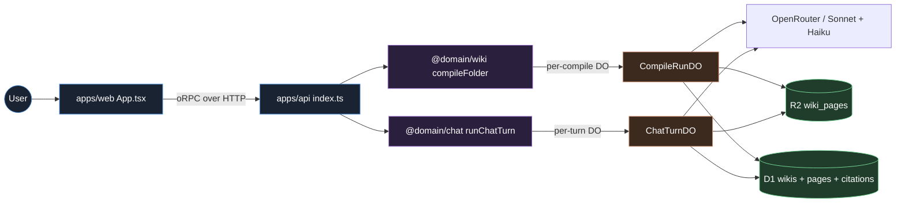
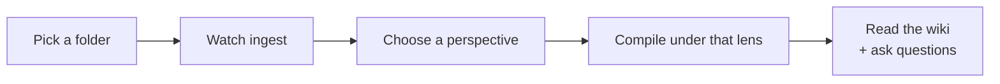
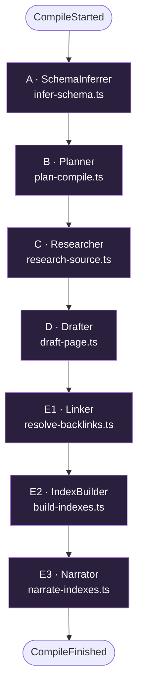
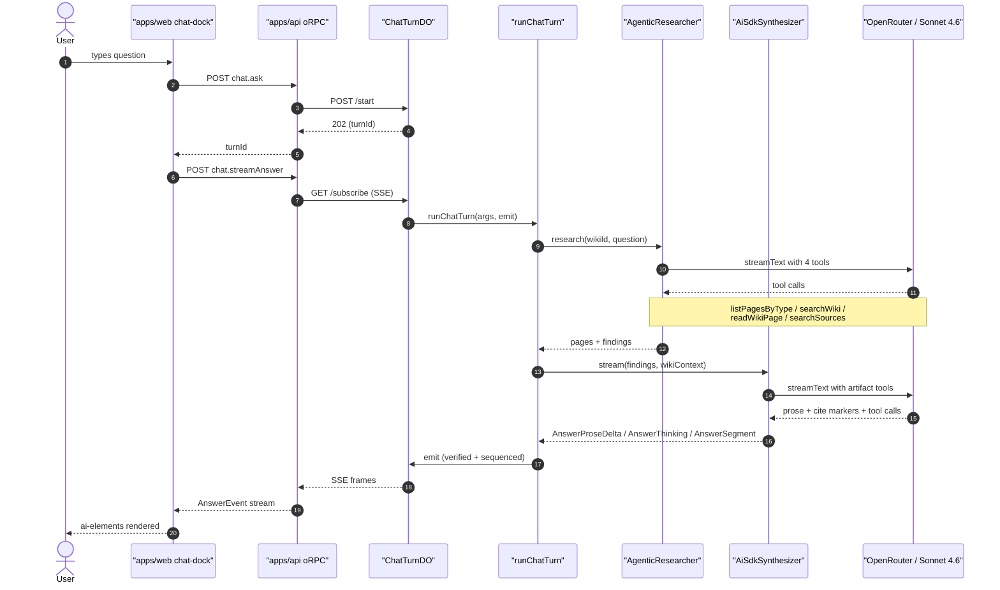

# Tenex — code tour

A walkthrough of how tenex actually works, file-by-file, ordered the way
a user's request flows through the system. Designed as a companion to
the `/present` deck — same arc, but with the actual code.

## TL;DR — the bet

Most search systems take a user query and run it against a generic index
of the document. Tenex flips that: **the user supplies a "perspective"
before indexing**, and the compile pipeline builds a wiki shaped by that
lens. Three readers of the same book (screenwriter / philosopher /
linguist) produce three radically different wikis from the same source
text.

The technical bet: **move the agent loop upstream**. Instead of running
an agentic interpretation per chat question, pay the cost once at
ingest time. Cheap questions, deeper answers.

---

## System at a glance

Every node below links to the implementation file (click the
shape to jump to the source line on GitHub).



(`@domain/verification` exists — post-compile audit context that lints
each Claim against its Citation — but it's orthogonal to the
perspective story so it's omitted here.)

---

## The journey

A user does this:

1. Picks a Google Drive folder
2. Watches it ingest (each file's text + per-page byte offsets pulled
   into D1 + R2)
3. **Chooses a perspective** — a free-form lens like "find me business
   opportunities" or "scenes and characters for a screenplay"
4. The compile pipeline runs end-to-end under that lens
5. They land on the compiled wiki, can browse pages, can chat



Below, the actual code that powers each step.

---

## 1. Perspective UX — pick a lens before compile

After ingest finishes, the route pauses on a `'choosing-perspective'`
phase and renders the picker:

- **State machine + page chrome:**
  [`ingest.tsx`](../../apps/web/src/routes/ingest.tsx) — the route component
- **Picker component:**
  [`ingest.tsx:246` `PerspectivePicker`](../../apps/web/src/routes/ingest.tsx#L246) — left-column radio list + right-column textarea
- **Preset bodies:**
  [`perspective-presets.ts:37` `PERSPECTIVE_PRESETS`](../../apps/web/src/lib/perspective-presets.ts#L37) — 5 presets (Business / Novel / Engineering / Research / Custom)

The user sees and can edit **exactly what the model will be told**
before kicking off compile. The "Custom" preset is just an empty
starting canvas; the "Skip" button runs a generic compile with no
perspective.

**Why presets are full editable text (not labels mapped to fixed
prompts):** transparency. The user can add domain notes inline (e.g.
"we sell B2B SaaS to SMBs") and they'll thread through every prompt.

---

## 2. The compile pipeline

**Entry point:** the user clicks "Compile with this perspective →"
which calls `wiki.startCompile({ folderId, perspective })` (the oRPC
procedure). That's wired in:

- **Contract:**
  [`compile.ts:31` `StartCompileInput`](../../packages/contracts/src/wiki/compile.ts#L31) — Zod schema with optional `perspective: z.string().min(1).max(4000).optional()`
- **Handler:**
  [`interface/index.ts:59` `startCompile`](../../packages/domains/wiki/src/interface/index.ts#L59) — thin oRPC wrapper that mints a `compileRunId` and hands off to the dispatcher
- **DO dispatcher client:**
  [`cf-compile-run-dispatcher.ts`](../../packages/domains/wiki/src/infrastructure/cf-compile-run-dispatcher.ts) — POSTs `/start` to the CompileRunDO, anchors via `waitUntil` so the run outlives the response

**The CompileRunDO** ([`compile-run-do.ts`](../../packages/domains/wiki/src/infrastructure/durable_objects/compile-run-do.ts))
hosts the multi-minute compile. Its `/start` calls
`state.waitUntil(this.run(cmd))` and its `/subscribe` streams the
event tape as SSE. This is necessary because Workers terminate after
the response; a DO is the only addressable home that survives.

The run executes
[`compile-folder.ts:147` `compileFolder`](../../packages/domains/wiki/src/application/compile-folder.ts#L147),
the orchestrator that drives **five stages**, each backed by an LLM call.

Click any stage box to jump to its implementation.



Orchestrator: [`compile-folder.ts:147` `compileFolder`](../../packages/domains/wiki/src/application/compile-folder.ts#L147).
Perspective enforcement scaffold:
[`perspective-preamble.ts:138` `withPerspective`](../../packages/domains/wiki/src/application/perspective-preamble.ts#L138).

### Stage A — SchemaInferrer

[`infer-schema.ts:66` `inferSchema`](../../packages/domains/wiki/src/application/infer-schema.ts#L66)

Reads the first 10 sources and returns a typed schema:

```ts
{ pageTypes: [{ name, description }], relations: [...], reason }
```

This is where the perspective bites hardest. Without perspective, the
schema picks generic PageType names (Decision / Person / Metric)
fitted to the corpus's literal shape. With perspective set, the schema
is told to **name PageTypes in the perspective's vocabulary**
(Opportunity / Pain / Wedge / Risk under a business lens).

The model is `anthropic/claude-sonnet-4.6` — quality matters here
because every downstream stage uses these names.

### Stage B — Planner

[`plan-compile.ts:71` `planCompile`](../../packages/domains/wiki/src/application/plan-compile.ts#L71)

For each source, decides which PageTypes apply. Returns
`{ tasks: [{ sourceId, pageTypes }] }`.

The key prompt rule (in the perspective preamble): **a source that
"literally describes a Tool" under a business lens ALSO supports
Opportunity, Pain, Wedge, Customer, Risk findings**. The Planner
assigns multiple angles per source so the Researcher doesn't return
only Tool findings.

### Stage C — Researcher (per source, sequential)

[`research-source.ts:89` `researchSource`](../../packages/domains/wiki/src/application/research-source.ts#L89)

For each `(source, pageTypes)` task, extracts findings:

```ts
{ pageType, title, evidence, spanStart, spanEnd }[]
```

The Researcher **must produce at least one finding per assigned
PageType** — reinterpreting the same source content through each angle
the perspective demands. Findings carry verbatim quotes + byte ranges
that become citations downstream.

### Stage D — Drafter (per `(pageType, title)` bucket, parallel)

[`draft-page.ts:129` `draftPage`](../../packages/domains/wiki/src/application/draft-page.ts#L129)

For each bucket of related findings, writes one Concept page in
markdown. Each claim in the body is paired with citations whose byte
ranges point back into the source.

Bucketing logic lives in `compile-folder.ts` around the `byType` and
`dispatchQueue` blocks just before the drafter dispatch:

- Group findings by `(pageType, normalizedTitle)` — each group → one page
- Cap at 24 total drafts, 8 per pageType, round-robin so no type starves
- See [`compile-folder.ts:147` `compileFolder`](../../packages/domains/wiki/src/application/compile-folder.ts#L147)
  step 5 ("Draft per (PageType, title) bucket")

### Stage E — Linker + IndexBuilder

- [`resolve-backlinks.ts:15` `resolveBacklinks`](../../packages/domains/wiki/src/application/resolve-backlinks.ts#L15)
  scans `[[link]]` markers in page bodies and resolves them through
  the schema's relation cardinality
- [`build-indexes.ts:27` `buildIndexes`](../../packages/domains/wiki/src/application/build-indexes.ts#L27)
  generates one Index page per PageType (a table of contents)
- [`narrate-indexes.ts:64` `narrateIndexes`](../../packages/domains/wiki/src/application/narrate-indexes.ts#L64)
  writes an opinionated thesis + per-section narrative + glossary,
  also under the perspective lens

---

## 3. Perspective enforcement — the load-bearing prompt scaffold

The whole enforcement scaffold lives in one file:

- [`perspective-preamble.ts:138` `withPerspective`](../../packages/domains/wiki/src/application/perspective-preamble.ts#L138)
  — the helper every stage wraps its system prompt with
- [`perspective-preamble.ts:12` `STAGE_DIRECTIVES`](../../packages/domains/wiki/src/application/perspective-preamble.ts#L12)
  — the five stage-specific clauses
- [`perspective-preamble.ts:166` `perspectiveUserHeader`](../../packages/domains/wiki/src/application/perspective-preamble.ts#L166)
  — the one-line reminder prepended to every USER message

`withPerspective(systemPrompt, perspective, { stage })` prepends a
HARD-CONSTRAINT block at the top of the system message:

```
PERSPECTIVE (load-bearing — read first, apply throughout):
{user's perspective text}
------------------------------------------------------------
[universal enforcement rules — generic = wrong, etc]
[stage-specific clause — schema / plan / research / draft / narrate]
============================================================
{original system prompt}
```

The five stage-specific clauses each address a different failure mode:

- `schema` — "Do not fall back to generic PageType names because the
  corpus's literal content fits a different shape. The user picked the
  perspective PRECISELY to reshape the corpus."
- `plan` — "Almost every source supports MULTIPLE perspective-shaped
  PageTypes from different angles."
- `research` — "For EACH assigned PageType, you MUST produce at least
  one finding by REINTERPRETING the same source through that angle."
- `draft` — "Open with the IMPLICATION under the perspective, not
  with background context."
- `narrate` — "The thesis must state what this wiki IS UNDER THE
  PERSPECTIVE, not what topic the corpus is about."

`perspectiveUserHeader()` also prepends a one-line reminder to every
USER message — repetition is the most reliable enforcement we have
short of fine-tuning.

---

## 4. Storage — D1 + R2

**Tables** (full schema in
[`001_init.sql`](../../packages/domains/wiki/src/infrastructure/migrations/001_init.sql)
plus the perspective column from
[`002_perspective.sql`](../../packages/domains/wiki/src/infrastructure/migrations/002_perspective.sql)):

- `wikis` — id, folder_id, schema_json, perspective (added in `002`)
- `wiki_pages` — id, wiki_id, subtype (Concept/Summary/Answer/Index), page_type, slug, title, body_r2_key
- `claims` — wiki_page_id, paragraph_id, claim_text
- `citations` — claim_id, source_id, byte_range_start/end, content_hash, label
- `backlinks` — from_page_id, to_page_id, relation_name

**R2 layout:**

- `wiki_pages/<page-id>.md` — the compiled page body (markdown)
- `sources/<source-id>/text` — the extracted PDF / markdown text
- `sources/<source-id>/raw` — the raw bytes (for "view original")

**Repos:**

- [`d1-wiki-page-repo.ts`](../../packages/domains/wiki/src/infrastructure/d1-wiki-page-repo.ts)
  — `insertMany` writes R2 first, then D1 in one batch; rolls back R2
  if D1 fails
- [`r2-wiki-page-storage.ts`](../../packages/domains/wiki/src/infrastructure/r2-wiki-page-storage.ts)
  — the canonical key contract: `wiki_pages/<id>.md` (the bare-id read
  bug story below — search "R2 key bug")
- [`d1-wiki-repo.ts`](../../packages/domains/wiki/src/infrastructure/d1-wiki-repo.ts)
  — wiki record CRUD, including the `perspective` column

---

## 5. The chat pipeline

When a user asks a question, four layers cooperate:



Sequence-diagram participants don't support clickable links, so here's
the implementation index for each one:

| Step | Implementation |
|---|---|
| Web · chat-dock + transport | [`chat-dock.tsx`](../../apps/web/src/components/chat-dock/chat-dock.tsx) · [`chat-transport.ts`](../../apps/web/src/lib/chat-transport.ts) |
| ChatTurnDO factory | [`chat-turn-do.ts:87` `createChatTurnDOClass`](../../packages/domains/chat/src/infrastructure/durable_objects/chat-turn-do.ts#L87) |
| Dispatcher client (Worker → DO) | [`cf-chat-turn-dispatcher.ts:17` `createCfChatTurnDispatcher`](../../packages/domains/chat/src/infrastructure/cf-chat-turn-dispatcher.ts#L17) |
| Runner | [`run-chat-turn.ts:82` `runChatTurn`](../../packages/domains/chat/src/application/run-chat-turn.ts#L82) |
| Agent (4 tools) | [`agentic-researcher.ts:170` `createAgenticResearcher`](../../packages/domains/chat/src/infrastructure/agentic-researcher.ts#L170) |
| Synth (artifact tools + citation parsing) | [`ai-sdk-synthesizer.ts:492` `createAiSdkSynthesizer`](../../packages/domains/chat/src/infrastructure/ai-sdk-synthesizer.ts#L492) |
| Citation tripwire | [`synthesize-answer.ts:163` `synthesizeAnswer`](../../packages/domains/chat/src/application/synthesize-answer.ts#L163) |
| DirectWikiReader (R2/D1 reads behind tools) | [`build-chat-context.ts:168` `createDirectWikiReader`](../../apps/api/src/build-chat-context.ts#L168) |

### Why a Durable Object for chat too

- **Factory:** [`chat-turn-do.ts:87` `createChatTurnDOClass`](../../packages/domains/chat/src/infrastructure/durable_objects/chat-turn-do.ts#L87)
- **Worker → DO client:** [`cf-chat-turn-dispatcher.ts:17` `createCfChatTurnDispatcher`](../../packages/domains/chat/src/infrastructure/cf-chat-turn-dispatcher.ts#L17)

The in-memory dispatcher kept the per-turn tape in a `Map` scoped to
one Worker isolate. On Cloudflare, `chat.ask` and `chat.streamAnswer`
are separate HTTP requests that often land on different isolates — the
second one finds an empty tape and waits forever. The DO is keyed by
`${conversationId}:${turnId}` so both requests share state regardless
of which isolate handles each.

`ChatTurnDO` has the same two-endpoint shape as the wiki's
`CompileRunDO`:

- `POST /start` — kicks off `runChatTurn` inside `state.waitUntil`
- `GET /subscribe` — replays the tape + streams live SSE

### The chat-turn runner

[`run-chat-turn.ts:82` `runChatTurn`](../../packages/domains/chat/src/application/run-chat-turn.ts#L82)

Emits an ordered AnswerEvent stream:

```
AnswerStarted →
ResearchStarted →
(WikiPageRetrieved | ResearchProgress)* →
ResearchCompleted →
SynthesisStarted →
(AnswerThinking | AnswerProseDelta | AnswerSegment)* →
AnswerFinished | AnswerFailed
```

Each event is sequenced by the DO and streamed to subscribers; a late
subscriber gets a full replay.

### The agent — four tools

- [`agentic-researcher.ts:170` `createAgenticResearcher`](../../packages/domains/chat/src/infrastructure/agentic-researcher.ts#L170)
  — the agent factory
- [`agentic-researcher.ts:123` `buildSystem`](../../packages/domains/chat/src/infrastructure/agentic-researcher.ts#L123)
  — injects the wiki-taxonomy block into the system prompt
- [`agentic-researcher.ts:224` `tools = { ... }`](../../packages/domains/chat/src/infrastructure/agentic-researcher.ts#L224)
  — the four tool definitions

Built on `streamText({ tools, stopWhen: stepCountIs(8) })`. The agent
gets a system prompt with the wiki's **taxonomy block** (PageType
list + perspective text + folder name, fetched via
`wikiReader.getWikiMeta`) and four tools:

| Tool              | What it does                                                                                       |
|-------------------|----------------------------------------------------------------------------------------------------|
| `searchWiki`      | Token-overlap search over page title + body                                                        |
| `readWikiPage`    | Fetch a page's full body + citations by id                                                         |
| `searchSources`   | Search raw source text (PDF extracts) when page-level search misses; returns citing pages          |
| `listPagesByType` | Enumerate every Concept page in a given PageType section (browse by name instead of keyword-guess) |

The agent's first instruction: **"If the user's question maps to one
of the PageTypes in the taxonomy (e.g. 'business ideas' → Opportunity),
call `listPagesByType` FIRST."** This is the rule that fixes the
keyword-guessing failure mode.

### The synthesizer

- [`ai-sdk-synthesizer.ts:492` `createAiSdkSynthesizer`](../../packages/domains/chat/src/infrastructure/ai-sdk-synthesizer.ts#L492)
  — the synth factory
- [`ai-sdk-synthesizer.ts:262` `renderContextHeader`](../../packages/domains/chat/src/infrastructure/ai-sdk-synthesizer.ts#L262)
  — emits the `<wiki-context>` block prepended to the user message

Built on `streamText({ tools })` where the tools are the **artifact
registry** (ComparisonTable / Timeline / KeyMetric / Quote / etc).
Each artifact kind's `inputSchema` carries one shape; the synth picks
a tool per structured-data segment.

The agent's findings are passed in along with a **`<wiki-context>`
block** stating the perspective + section vocabulary so the synth
knows the framing is deliberate. This is what prevents the "findings
appear empty" hallucination when the user query vocabulary doesn't
match the page-body vocabulary.

Inline citation markers (`[[cite:UUID]]`) are parsed out of the prose
stream and emitted as separate `citation` segments; the use-case
verifies each citation hash before it reaches the SSE tape.

---

## 6. Citation grounding — the fabrication tripwire

Every claim in a synthesized answer must be backed by a verifiable
citation. The tripwire:

1. The synth emits `[[cite:UUID]]` markers in prose
2. [`synthesize-answer.ts:163` `synthesizeAnswer`](../../packages/domains/chat/src/application/synthesize-answer.ts#L163)
   resolves each UUID against the working set of findings
3. Each Citation has a `contentHash` of the byte range it covers
   (written at compile time by
   [`compile-folder.ts:135` `sliceHash`](../../packages/domains/wiki/src/application/compile-folder.ts#L135))
4. Before emission,
   [`verify-citation.ts:20` `createMemorySourceHashVerifier`](../../packages/domains/chat/src/application/verify-citation.ts#L20)
   re-hashes the actual source text at that byte range and compares
5. Hash mismatch → `CitationTripwireError` → turn aborts with
   `AnswerFailed`

Source bodies live at `sources/<id>/text` in R2; the verifier reads
them via the bindings the api already holds (no oRPC round-trip).
Wired in
[`build-chat-context.ts`](../../apps/api/src/build-chat-context.ts) at
the `createMemorySourceHashVerifier({ readSourceText, sha256Hex })`
call.

---

## 7. Frontend — chat dock + presentation

- [`App.tsx:9` `App`](../../apps/web/src/App.tsx#L9) — wraps router + `<ChatDock>` in a horizontal flex row
- [`chat-dock.tsx:100` `ChatDock`](../../apps/web/src/components/chat-dock/chat-dock.tsx#L100) — `sticky top-0 h-screen` aside; drag handle resizes; width persists to localStorage; closing animates width to 0
- [`chat-transport.ts`](../../apps/web/src/lib/chat-transport.ts) — parses oRPC SSE frames and translates each AnswerEvent into the AI Elements `UIMessageChunk` shape:
  - `WikiPageRetrieved` → `reasoning-delta` + `data-wiki-page-retrieved`
  - `AnswerThinking` → `reasoning-delta` (live train-of-thought from synth)
  - `AnswerProseDelta` → `text-delta`
  - `AnswerSegment(citation)` → `data-citation`
  - `AnswerSegment(artifact)` → `data-artifact`
- [`present.tsx`](../../apps/web/src/routes/present.tsx) — the 14-slide non-technical talk at `/present`. Arrow keys to navigate, F for fullscreen.

---

## 8. Lessons / interesting bugs

A few things that bit us, ordered by impact. Useful color for a
walkthrough.

### "The chat sees fragments" — the R2 key bug

For a while, every wiki the chat surfaced returned "limited text
fragments" no matter how rich the compiled pages were. Root cause:
the chat reader was reading R2 at the bare page id (`<uuid>`) but the
canonical writer
([`r2-wiki-page-storage.ts:4` `key`](../../packages/domains/wiki/src/infrastructure/r2-wiki-page-storage.ts#L4))
writes at `wiki_pages/<id>.md`. The chat's bodies came back empty;
only the source-text excerpts appended by
[`build-chat-context.ts:233` `expandWithSourceEvidence`](../../apps/api/src/build-chat-context.ts#L233)
made it into the synth prompt — and those were correctly limited to
600 chars each. Fix:
[`build-chat-context.ts:206` `hydrate`](../../apps/api/src/build-chat-context.ts#L206) — one-char path change.

### Cross-isolate dispatcher

Chat originally used an in-memory dispatcher with the tape kept in a
per-isolate `Map`. `chat.ask` and `chat.streamAnswer` are separate
HTTP requests that don't reliably hit the same isolate on Cloudflare
— the second one would create a fresh empty tape and wait forever.
Fix: [`chat-turn-do.ts:87` `createChatTurnDOClass`](../../packages/domains/chat/src/infrastructure/durable_objects/chat-turn-do.ts#L87)
keyed by `${conversationId}:${turnId}` + thin client at
[`cf-chat-turn-dispatcher.ts:17`](../../packages/domains/chat/src/infrastructure/cf-chat-turn-dispatcher.ts#L17).

### Perspective enforcement too soft

First implementation was "bias toward this perspective." A music/AI
corpus compiled under business-opportunities still produced
Tool/Skill/Resource PageTypes because the model fell back to the
corpus's literal shape. Fix: HARD CONSTRAINT preamble + per-stage
clauses + USER-message repetition — see
[`perspective-preamble.ts:138` `withPerspective`](../../packages/domains/wiki/src/application/perspective-preamble.ts#L138)
and the `STAGE_DIRECTIVES` table at
[`perspective-preamble.ts:12`](../../packages/domains/wiki/src/application/perspective-preamble.ts#L12).

### Researcher emitting findings for one PageType only

The Planner would assign `[Tool]` for a source about a software tool,
the Researcher would only extract Tool findings — and the
Opportunity / Pain / Wedge sections of the compiled wiki would be
empty. Fix: the `plan` and `research` entries in
[`STAGE_DIRECTIVES`](../../packages/domains/wiki/src/application/perspective-preamble.ts#L12)
— the Planner now must assign multiple angles per source and the
Researcher must produce at least one finding per assigned PageType
(the "reinterpret the same source through each angle" rule).

### Agent keyword-guessing instead of browsing

The agent would search "ring" against a wiki that had an entire
Opportunity section and miss it because the user typed "business
ideas." Fix: the wiki taxonomy is injected into the agent's system
prompt by
[`agentic-researcher.ts:123` `buildSystem`](../../packages/domains/chat/src/infrastructure/agentic-researcher.ts#L123)
and the `listPagesByType` tool (added in the
[`tools = { ... }`](../../packages/domains/chat/src/infrastructure/agentic-researcher.ts#L224) block)
lets it browse by name.

---

## 9. Where to start the code tour

If you're walking someone through the codebase for the first time,
here's a 15-minute path that hits the high points (line-anchored —
jump straight to the right function):

1. [`perspective-presets.ts:37` `PERSPECTIVE_PRESETS`](../../apps/web/src/lib/perspective-presets.ts#L37)
   — see what the user actually picks
2. [`compile.ts:31` `StartCompileInput`](../../packages/contracts/src/wiki/compile.ts#L31)
   — see how perspective enters the contract layer
3. [`compile-folder.ts:147` `compileFolder`](../../packages/domains/wiki/src/application/compile-folder.ts#L147)
   — read the orchestrator top to bottom (one function, ~600 lines)
4. [`perspective-preamble.ts:138` `withPerspective`](../../packages/domains/wiki/src/application/perspective-preamble.ts#L138) + [`STAGE_DIRECTIVES`](../../packages/domains/wiki/src/application/perspective-preamble.ts#L12)
   — the universal + stage-specific enforcement clauses
5. [`infer-schema.ts:66` `inferSchema`](../../packages/domains/wiki/src/application/infer-schema.ts#L66)
   — see `withPerspective(SYSTEM, perspective, { stage: 'schema' })` wire up
6. [`agentic-researcher.ts:170` `createAgenticResearcher`](../../packages/domains/chat/src/infrastructure/agentic-researcher.ts#L170)
   — the four-tool agent + the wiki-taxonomy system-prompt injection at [`buildSystem`](../../packages/domains/chat/src/infrastructure/agentic-researcher.ts#L123)
7. [`ai-sdk-synthesizer.ts:492` `createAiSdkSynthesizer`](../../packages/domains/chat/src/infrastructure/ai-sdk-synthesizer.ts#L492)
   — the artifact-tool registry + the `<wiki-context>` block at [`renderContextHeader`](../../packages/domains/chat/src/infrastructure/ai-sdk-synthesizer.ts#L262)
8. [`synthesize-answer.ts:163` `synthesizeAnswer`](../../packages/domains/chat/src/application/synthesize-answer.ts#L163)
   — the citation tripwire

The architecture overview in
[`docs/architecture/README.md`](./README.md) covers the cross-cutting
constraints (DDD bounded contexts, contract-first oRPC, glossary
discipline) if you need that context.
