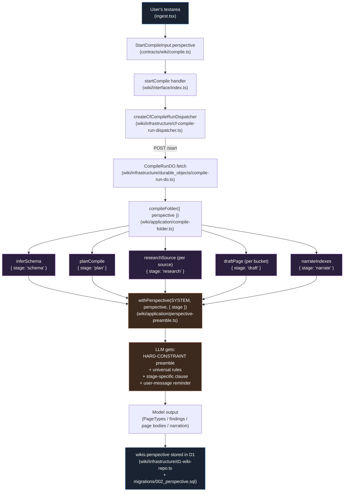

# Perspective flow — how the lens reaches every prompt

Companion to [`code-tour.md`](./code-tour.md). Diagrams the path the
perspective text takes from the user's textarea into every model call
during the compile, with file:line references.

## Compile-time flow



## Chat-time flow — picking the lens back up

```mermaid
flowchart LR
    Q["User question<br/>chat.ask"] --> Turn["runChatTurn<br/>(chat/application/run-chat-turn.ts)"]
    Turn --> Meta["wikiReader.getWikiMeta(wikiId)<br/>returns { perspective, pageTypes, folderName }"]
    Meta --> Agent["Agentic researcher<br/>(agentic-researcher.ts)"]
    Meta --> Synth["Synthesizer<br/>(ai-sdk-synthesizer.ts)"]

    Agent --> AgentSys["System prompt now includes<br/>'Wiki taxonomy' block:<br/>– PageType list<br/>– perspective (first line)"]
    AgentSys --> Tools["Agent uses:<br/>listPagesByType / searchWiki /<br/>searchSources / readWikiPage"]

    Tools --> Findings["Pages → findings<br/>(quoteText = full page body)"]

    Findings --> Synth
    Synth --> Ctx["User message prepended with<br/>&lt;wiki-context&gt; block:<br/>– perspective<br/>– section names"]
    Ctx --> Answer["AnswerEvent stream<br/>(prose + citations + artifacts)"]

    classDef edge fill:#1a2332,stroke:#4a90e2,color:#fff;
    classDef ctx fill:#3d2a1f,stroke:#d89878,color:#fff;
    class Q,Answer edge;
    class AgentSys,Ctx ctx;
```



`(*)` `researchSource` runs once per source; `draftPage` runs once per
`(pageType, title)` bucket. Everything else runs once per compile.

## File map

| Step | File | What carries the perspective |
|---|---|---|
| 1. UX | [`apps/web/src/routes/ingest.tsx`](../../apps/web/src/routes/ingest.tsx) | `phase === 'choosing-perspective'`, `<PerspectivePicker>` |
| 1a. Presets | [`apps/web/src/lib/perspective-presets.ts`](../../apps/web/src/lib/perspective-presets.ts) | Editable `prompt` text per preset |
| 2. Contract | [`packages/contracts/src/wiki/compile.ts`](../../packages/contracts/src/wiki/compile.ts) | `StartCompileInput.perspective?: string` |
| 3. Handler | [`packages/domains/wiki/src/interface/index.ts`](../../packages/domains/wiki/src/interface/index.ts) | `startCompile` handler passes through |
| 4. Dispatcher port | [`packages/domains/wiki/src/application/ports.ts`](../../packages/domains/wiki/src/application/ports.ts) | `CompileRunDispatcher.start({ ..., perspective })` |
| 5. DO client | [`packages/domains/wiki/src/infrastructure/cf-compile-run-dispatcher.ts`](../../packages/domains/wiki/src/infrastructure/cf-compile-run-dispatcher.ts) | POSTs `{ ..., perspective }` into the DO |
| 6. DO | [`packages/domains/wiki/src/infrastructure/durable_objects/compile-run-do.ts`](../../packages/domains/wiki/src/infrastructure/durable_objects/compile-run-do.ts) | Calls `compileFolder(deps, { ..., perspective })` |
| 7. Orchestrator | [`packages/domains/wiki/src/application/compile-folder.ts`](../../packages/domains/wiki/src/application/compile-folder.ts) | Passes through to each stage |
| 8a. Schema | [`packages/domains/wiki/src/application/infer-schema.ts`](../../packages/domains/wiki/src/application/infer-schema.ts) | `withPerspective(SYSTEM, perspective, { stage: 'schema' })` |
| 8b. Plan | [`packages/domains/wiki/src/application/plan-compile.ts`](../../packages/domains/wiki/src/application/plan-compile.ts) | `{ stage: 'plan' }` |
| 8c. Research | [`packages/domains/wiki/src/application/research-source.ts`](../../packages/domains/wiki/src/application/research-source.ts) | `{ stage: 'research' }` |
| 8d. Draft | [`packages/domains/wiki/src/application/draft-page.ts`](../../packages/domains/wiki/src/application/draft-page.ts) | `{ stage: 'draft' }` |
| 8e. Narrate | [`packages/domains/wiki/src/application/narrate-indexes.ts`](../../packages/domains/wiki/src/application/narrate-indexes.ts) | `{ stage: 'narrate' }` |
| 9. Enforcement | [`packages/domains/wiki/src/application/perspective-preamble.ts`](../../packages/domains/wiki/src/application/perspective-preamble.ts) | The actual preamble + stage clauses |
| 10. Persist | [`packages/domains/wiki/src/infrastructure/d1-wiki-repo.ts`](../../packages/domains/wiki/src/infrastructure/d1-wiki-repo.ts) | `INSERT/UPDATE wikis (..., perspective)` |
| 11. Migration | [`packages/domains/wiki/src/infrastructure/migrations/002_perspective.sql`](../../packages/domains/wiki/src/infrastructure/migrations/002_perspective.sql) | `ALTER TABLE wikis ADD COLUMN perspective TEXT` |
| 12. Chat read | [`packages/domains/chat/src/application/run-chat-turn.ts`](../../packages/domains/chat/src/application/run-chat-turn.ts) | `getWikiMeta()` → `wikiContext` to synth |
| 13. Chat agent | [`packages/domains/chat/src/infrastructure/agentic-researcher.ts`](../../packages/domains/chat/src/infrastructure/agentic-researcher.ts) | Injects taxonomy into agent system prompt |
| 14. Chat synth | [`packages/domains/chat/src/infrastructure/ai-sdk-synthesizer.ts`](../../packages/domains/chat/src/infrastructure/ai-sdk-synthesizer.ts) | `<wiki-context>` block in user message |

## What each enforcement clause looks like

The preamble (top of every system prompt when perspective is set):

```
========================================================================
PERSPECTIVE (load-bearing — read first, apply throughout):

{user's perspective text — e.g. "Read this corpus as a founder hunting
for a business to start, fund, or expand…"}

------------------------------------------------------------------------
This perspective is a HARD CONSTRAINT on your output, not a soft
suggestion. The user paid for a wiki built UNDER THIS LENS — produce
that, not a generic wiki of the corpus.

Rules:
1. Every PageType name, every page title, every section heading must
   read as if a perspective-holder authored it.
2. Rank what to include by the perspective's priorities.
3. Frame every finding around its IMPLICATION under the perspective.
4. If you catch yourself producing output that could come from any wiki
   of any corpus on any topic, STOP and re-anchor. Generic = wrong.
5. Structural rules in the prompt below always win.
…
{stage-specific clause}
========================================================================

{original system prompt}
```

Stage clauses live in `STAGE_DIRECTIVES` in
[`perspective-preamble.ts`](../../packages/domains/wiki/src/application/perspective-preamble.ts).

## The user-message header

In addition to the system preamble, every USER message gets prepended
with a one-line reminder via `perspectiveUserHeader()`:

```
Reminder — apply the PERSPECTIVE from the system message to everything
below. PageType names, titles, and findings must reflect that lens,
not the corpus's literal shape.

{actual prompt content}
```

Repetition through both channels is the most reliable enforcement we
have short of fine-tuning. Documented in the
[`perspective-preamble.ts`](../../packages/domains/wiki/src/application/perspective-preamble.ts)
header comment.

## At chat time — the lens is still on

When a question arrives,
[`runChatTurn`](../../packages/domains/chat/src/application/run-chat-turn.ts)
calls `wikiReader.getWikiMeta(wikiId)` to fetch
`{ perspective, pageTypes, folderName }` from the wiki record.

Two paths use this:

1. **Agent system prompt** — the
   [`agentic-researcher`](../../packages/domains/chat/src/infrastructure/agentic-researcher.ts)
   builds a per-wiki system prompt with the PageType taxonomy + the
   first line of the perspective text. The agent then knows to call
   `listPagesByType("Opportunity")` when the user asks about "business
   ideas".
2. **Synth user message** — the
   [`ai-sdk-synthesizer`](../../packages/domains/chat/src/infrastructure/ai-sdk-synthesizer.ts)
   prepends a `<wiki-context>` block with the perspective + section
   list so the synth knows the framing is deliberate and doesn't
   hallucinate "this wiki doesn't cover X" on vocabulary gaps.

That's the loop. Every stage of compile, every stage of chat, knows
the perspective. Three different perspectives on the same folder → three
different wikis → three different chat experiences.
