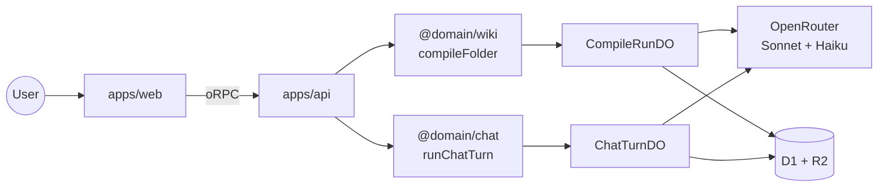
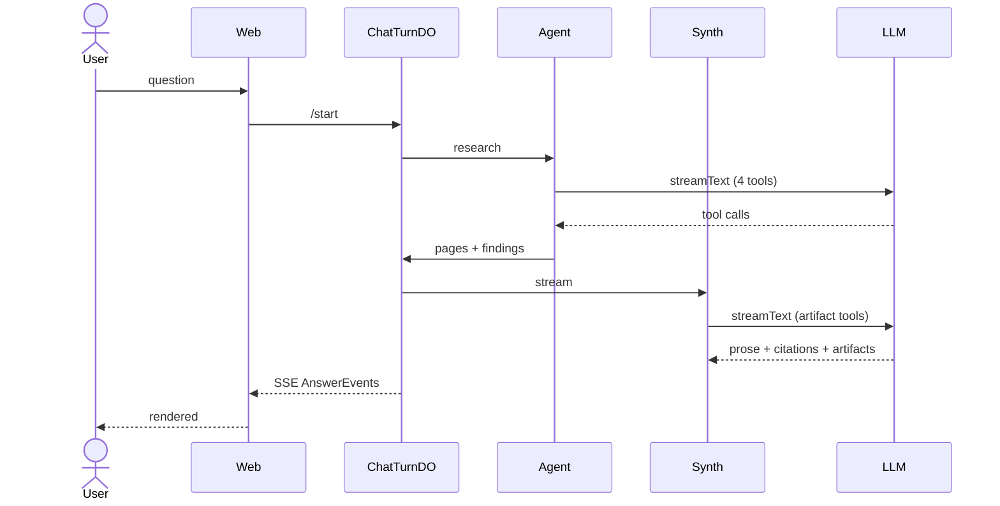

# 3-minute walk-along — screen-share

Scroll through this while you talk. Each beat is one screen-ish of
content: a header, the spoken line in **bold blockquote**, then the
load-bearing code from that beat (inlined verbatim, with a deep link
on the file path).

For the longer version of any beat:
[`code-tour.md`](./code-tour.md) ·
[`perspective-flow.md`](./perspective-flow.md).

---

# Beat 1 · the bet  `0:00–0:35`

> **Most search systems take your query and run it against a generic
> index. Tenex flips that: you give it a *perspective* before
> indexing, and the wiki gets built around your point of view.** Three
> readers of the same book — screenwriter, philosopher, linguist —
> produce three different wikis from the same source. The technical
> version: **move the agent loop upstream**. Pay the cost of
> interpretation once at ingest, get cheap, deep questions at chat
> time. Concretely — a music corpus compiled under "business
> opportunities" should produce **Opportunity / Pain / Wedge**
> sections, not Tool / Topic / Concept.

The user picks one of these before compile starts — full editable
text, so they see exactly what the model is told.

📄 [`apps/web/src/lib/perspective-presets.ts:37`](../../apps/web/src/lib/perspective-presets.ts#L37)

```ts
export const PERSPECTIVE_PRESETS = [
  {
    id: 'business-opportunities',
    label: 'Business opportunities',
    prompt: `Read this corpus as a founder hunting for a business to
start, fund, or expand.

Naming conventions (use these — they shape every page):
- PageType names: prefer Opportunity, Pain, Customer, Channel,
  Competitor, Trend, Wedge, Risk. Reject generic "Topic" / "Concept".
- Page titles: name the finding, not the topic.
  "AP teams pay $40K/yr for invoice OCR" beats "Invoice software".
- One sharp opportunity per page, sized and risked.`,
  },
  // novel-writing · engineering-decisions · research-synthesis · custom
];
```

---

# Beat 2 · system architecture  `0:35–1:00`

> **React frontend, Hono Worker, oRPC for the contract layer with
> Zod.** The codebase is domain-driven — one package per bounded
> context (ingestion, wiki, chat, verification), each with its own
> glossary. **Application layer is framework-free** and dependencies
> inject. **Contract-first**, so the contract types power both the API
> and the client.



```
packages/
  contracts/                 # @package/contracts (oRPC + Zod)
  shared-kernel/
  domains/
    ingestion/               # Drive → R2/D1
    wiki/                    # compile pipeline
    chat/                    # agent + synth
    verification/            # claim audits
```

---

# Beat 3 · compile pipeline  `1:00–1:45`

> Compile is **five stages**: infer schema → plan → research → draft →
> link + index. Each stage's prompt gets wrapped by one helper called
> **`withPerspective`** — a hard-constraint preamble plus a
> stage-specific clause — and we restate the perspective on the user
> message of every call. **Repetition is the most reliable enforcement
> short of fine-tuning.** Researcher findings carry byte ranges; those
> become citations we hash, which matters in a second.


The orchestrator —
📄 [`compile-folder.ts:147` `compileFolder`](../../packages/domains/wiki/src/application/compile-folder.ts#L147):

```ts
export async function compileFolder(deps, input) {
  const { schema } = await inferSchema(
    { llm: deps.llm },
    { sources: headTexts, perspective: input.perspective },
  );
  const { tasks } = await planCompile(
    { llm: deps.llm },
    { schema, sources, perspective: input.perspective },
  );
  const { findings } = await researchSource(
    { llm: deps.llm },
    { source, pageTypes, perspective: input.perspective },
  );
  const { draft } = await draftPage(
    { llm: deps.llm },
    { pageType, findings, perspective: input.perspective },
  );
  // ...resolveBacklinks → buildIndexes → narrateIndexes
}
```

The enforcement scaffold — every stage wraps its system prompt with
this helper.

📄 [`perspective-preamble.ts:138` `withPerspective`](../../packages/domains/wiki/src/application/perspective-preamble.ts#L138):

```ts
export const withPerspective = (systemPrompt, perspective, { stage }) => {
  if (!perspective) return systemPrompt;
  return `========================================================
PERSPECTIVE (load-bearing — read first, apply throughout):

${perspective}

--------------------------------------------------------
${UNIVERSAL_ENFORCEMENT}
${STAGE_DIRECTIVES[stage]}
========================================================

${systemPrompt}`;
};
```

What "universal enforcement" actually says to the model:

```
This perspective is a HARD CONSTRAINT, not a soft suggestion.

1. Every PageType name, page title, section heading must read as if a
   perspective-holder wrote it. Generic alternatives are failures.
2. Rank what to include by the perspective's priorities.
3. Frame every finding around its IMPLICATION under the perspective.
4. If you catch yourself producing output that could come from any
   wiki of any corpus on any topic, STOP and re-anchor.
   Generic = wrong.
5. Structural rules in the prompt below always win.
```

---

# Beat 4 · chat pipeline  `1:45–2:25`

> The agent is a **`streamText` loop with four tools**:
> `listPagesByType` to browse a section by name, `searchWiki` for
> keyword overlap, `readWikiPage` to pull a full body, `searchSources`
> to fall through to the underlying PDF text. The **model chooses
> which tools to call and in what order** — that's what makes this
> different from a fixed RAG pipeline. It runs inside a **per-turn
> Durable Object** so the event tape survives the request lifecycle.



The streamText call —
📄 [`agentic-researcher.ts:170`](../../packages/domains/chat/src/infrastructure/agentic-researcher.ts#L170):

```ts
const result = streamText({
  model: opts.model,
  tools,                              // 4 tools below
  toolChoice: 'auto',                 // model picks which + when
  stopWhen: stepCountIs(opts.maxSteps ?? 8),
  system: buildSystem(meta),          // injects wiki taxonomy
  prompt: `Question: ${input.question}`,
});
```

One tool — `listPagesByType` — the one that fixes "the agent missed
the Opportunity section because the user typed 'business ideas'":

📄 [`agentic-researcher.ts:289`](../../packages/domains/chat/src/infrastructure/agentic-researcher.ts#L289):

```ts
listPagesByType: tool({
  description:
    "Enumerate every Concept page in the wiki under a given " +
    "PageType. Use this when the user's question maps to one of " +
    "the PageType names in the wiki's taxonomy — e.g. 'business " +
    "ideas' → 'Opportunity'.",
  inputSchema: z.object({ pageType: z.string() }),
  execute: async ({ pageType }) => {
    const hits = await opts.wikiReader.listPagesByType({
      wikiId: input.wikiId, pageType, limit: TYPE_LIST_LIMIT,
    });
    for (const p of hits) noteVisit(p);
    return { count: hits.length, pages: hits.map(/* title + snippet */) };
  },
}),
```

---

# Beat 5 · synth + tripwire  `2:25–3:00`

> The agent's findings feed the synthesizer — a different `streamText`
> with **eight typed artifact tools**: ComparisonTable, Timeline,
> KeyMetric, Quote, LineChart, BarChart, CodeBlock, Markdown. The
> model picks the right artifact per segment, so a comparison answer
> renders as an actual table, not bulleted prose. While it drafts, we
> surface its tool-input deltas as live "thinking" lines so the
> bubble keeps moving. And **every citation gets hash-verified against
> the source bytes** before reaching the user. The model can't invent
> a quote without also inventing a byte range that survives a hash
> check. That's how it stays grounded.

The eight artifact tools — the synth picks one per structured segment:

📄 [`ai-sdk-synthesizer.ts:28`](../../packages/domains/chat/src/infrastructure/ai-sdk-synthesizer.ts#L28):

```ts
const buildArtifactTools = () => ({
  ComparisonTable: tool({
    description: 'Use when comparing two or more items side-by-side.',
    inputSchema: z.object({
      columns: z.array(z.string()),
      rows: z.array(z.object({ cells: z.array(/* value, citationId */) })),
      citationIds,
    }),
    execute: async (input) => input,
  }),
  Timeline:   tool({ /* { events: [{ at, label, description }] } */ }),
  KeyMetric:  tool({ /* { label, value, delta, trend } */ }),
  Quote:      tool({ /* { text, attribution } */ }),
  LineChart:  tool({ /* { xLabel, yLabel, series } */ }),
  BarChart:   tool({ /* { xLabel, yLabel, bars } */ }),
  CodeBlock:  tool({ /* { language, source } */ }),
  Markdown:   tool({ /* { body } */ }),
});
```

The citation tripwire. Every `[[cite:UUID]]` marker the synth emits
gets verified before it reaches the SSE tape.

📄 [`synthesize-answer.ts:222`](../../packages/domains/chat/src/application/synthesize-answer.ts#L222):

```ts
const verify = async (c: Citation): Promise<void> => {
  const v = await deps.sourceHashes.verify(c);    // re-hash source bytes
  if (!v.ok) {
    throw new CitationTripwireError(
      `Citation ${c.id} failed hash check: ${v.reason}`,
    );
  }
};
```

The writer side of the same contract — every citation's
`contentHash` is the SHA-256 of the exact source-byte slice the
citation points to. A model can't invent a quote without also
inventing a byte range that hashes the same. Mismatch = fabrication.

📄 [`compile-folder.ts:135`](../../packages/domains/wiki/src/application/compile-folder.ts#L135):

```ts
const sliceHash = async (text, start, end) => {
  const slice = text.slice(start, end);
  const bytes = new TextEncoder().encode(slice);
  const buf = await crypto.subtle.digest('SHA-256', bytes);
  return `sha256:${toHex(buf)}` as ContentHash;
};
```

---

# Done

Where to go deeper:

- [`code-tour.md`](./code-tour.md) — every section, every helper,
  every interesting bug
- [`perspective-flow.md`](./perspective-flow.md) — perspective
  threading diagrammed
- `/present` — the non-technical 14-slide deck for the story side
