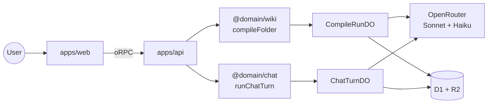
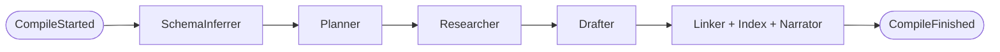
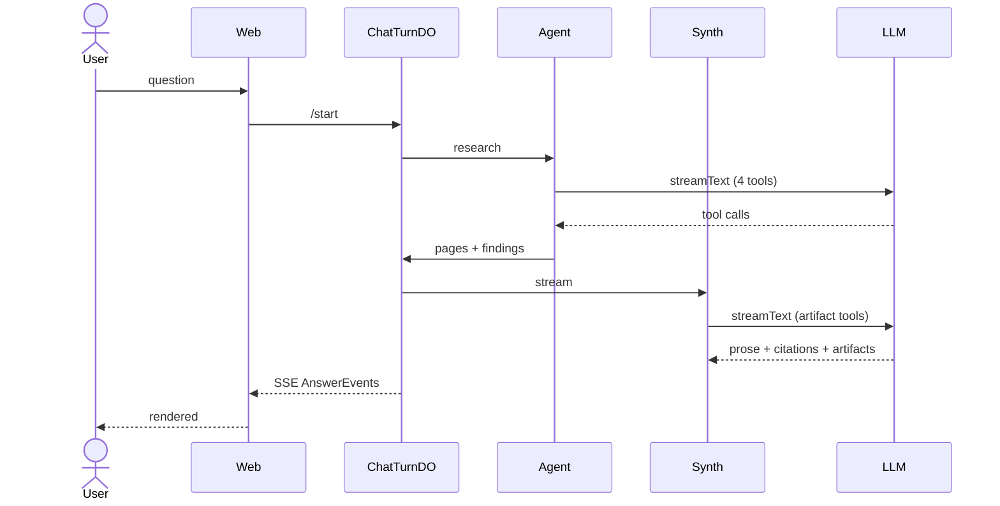

# Tenex — what it does and how it works

A scroll-through of the system. Each section opens with a short
context paragraph, then the diagrams and load-bearing code from that
part of the codebase. File paths are deep-linked to the exact line on
GitHub. For the full reference, see
[`code-tour.md`](./code-tour.md) and
[`perspective-flow.md`](./perspective-flow.md).

---

# The bet

Most search systems take your query and run it against a generic index
of the document. **Tenex flips that.** You give it a *perspective*
before indexing, and the wiki gets built around your point of view.
Three readers of the same book — a screenwriter, a philosopher, a
linguist — would write three radically different sets of notes. The
technical version of that bet: **move the agent loop upstream**. Pay
the cost of interpretation once at ingest; get cheap, deep questions
at chat time. Concretely — a music corpus compiled under "business
opportunities" should produce **Opportunity / Pain / Wedge** sections,
not Tool / Topic / Concept.

The perspective is a free-form text the user picks (or writes) before
the compile starts. Below is one of the bundled presets — full
editable text, so the user sees exactly what the model will be told.

📄 [`apps/web/src/lib/perspective-presets.ts:37`](../../apps/web/src/lib/perspective-presets.ts#L37)

```ts
export const PERSPECTIVE_PRESETS = [
  {
    id: 'business-opportunities',
    label: 'Business opportunities',
    prompt: `Read this corpus as a founder hunting for a business to
start, fund, or expand.

Naming conventions (use these — they shape every page):
- PageType names: prefer Opportunity, Pain, Customer, Channel,
  Competitor, Trend, Wedge, Risk. Reject generic "Topic" / "Concept".
- Page titles: name the finding, not the topic.
  "AP teams pay $40K/yr for invoice OCR" beats "Invoice software".
- One sharp opportunity per page, sized and risked.`,
  },
  // novel-writing · engineering-decisions · research-synthesis · custom
];
```

---

# System architecture

React frontend, Hono Worker, oRPC for the contract layer with Zod —
the same Zod schemas validate API requests and type the frontend
client. The codebase is domain-driven: one package per bounded
context (`ingestion`, `wiki`, `chat`, `verification`), each with its
own glossary. The application layer is framework-free and
dependencies inject through interfaces.

Two paths from the frontend: compile a folder into a wiki, or chat
with an existing wiki. Both paths route through Durable Objects so
the multi-minute work survives the request lifecycle.



```
packages/
  contracts/                 # @package/contracts (oRPC + Zod)
  shared-kernel/
  domains/
    ingestion/               # Drive → R2/D1
    wiki/                    # compile pipeline
    chat/                    # agent + synth
    verification/            # claim audits
```

---

# The compile pipeline

Compile turns a folder of source documents into a typed, cross-linked
wiki shaped by the user's perspective. It's five LLM-backed stages
running sequentially inside a Durable Object that hosts the per-run
event tape so live progress streams to the UI.



**Schema inference** reads the first ten sources and picks PageTypes —
the section names of the wiki. **The planner** then decides which
PageTypes each source supports; under a perspective it assigns
multiple angles per source so one document about a tool produces
Opportunity, Pain, and Wedge findings — not just Tool. **The
researcher** extracts verbatim quotes with byte offsets; those byte
ranges become citations the synthesizer will later need. **The
drafter** writes one magazine-quality page per
`(pageType, title)` bucket of findings. Finally **the linker, index
builder, and narrator** resolve backlinks, generate one Index page per
PageType, and write an opinionated thesis + glossary for the wiki.

The orchestrator threads the perspective into every stage:

📄 [`compile-folder.ts:147` `compileFolder`](../../packages/domains/wiki/src/application/compile-folder.ts#L147)

```ts
export async function compileFolder(deps, input) {
  const { schema } = await inferSchema(
    { llm: deps.llm },
    { sources: headTexts, perspective: input.perspective },
  );
  const { tasks } = await planCompile(
    { llm: deps.llm },
    { schema, sources, perspective: input.perspective },
  );
  const { findings } = await researchSource(
    { llm: deps.llm },
    { source, pageTypes, perspective: input.perspective },
  );
  const { draft } = await draftPage(
    { llm: deps.llm },
    { pageType, findings, perspective: input.perspective },
  );
  // ...resolveBacklinks → buildIndexes → narrateIndexes
}
```

---

# Perspective enforcement

The perspective is wrapped around every stage's system prompt with a
single helper. A naive "bias toward this perspective" prompt didn't
work — the model would fall back to the corpus's literal shape. The
real fix is a HARD CONSTRAINT preamble with explicit anti-patterns,
plus a stage-specific clause sharpened for what each stage produces,
plus a one-line reminder repeated on the USER message. Repetition is
the most reliable enforcement we have short of fine-tuning.

📄 [`perspective-preamble.ts:138` `withPerspective`](../../packages/domains/wiki/src/application/perspective-preamble.ts#L138)

```ts
export const withPerspective = (systemPrompt, perspective, { stage }) => {
  if (!perspective) return systemPrompt;
  return `========================================================
PERSPECTIVE (load-bearing — read first, apply throughout):

${perspective}

--------------------------------------------------------
${UNIVERSAL_ENFORCEMENT}
${STAGE_DIRECTIVES[stage]}
========================================================

${systemPrompt}`;
};
```

The universal rules every stage sees:

```
This perspective is a HARD CONSTRAINT, not a soft suggestion.

1. Every PageType name, page title, section heading must read as if a
   perspective-holder wrote it. Generic alternatives are failures.
2. Rank what to include by the perspective's priorities.
3. Frame every finding around its IMPLICATION under the perspective.
4. If you catch yourself producing output that could come from any
   wiki of any corpus on any topic, STOP and re-anchor.
   Generic = wrong.
5. Structural rules in the prompt below always win.
```

The stage-specific clause for SchemaInferrer — the one that prevents
the failure mode where a music corpus under "business" still produces
Tool/Topic/Concept:

📄 [`perspective-preamble.ts:12` `STAGE_DIRECTIVES.schema`](../../packages/domains/wiki/src/application/perspective-preamble.ts#L12)

```
STAGE: SchemaInferrer
You are about to name the PageTypes for this wiki. These names
cascade through every downstream step.

- A business-opportunities perspective on a corpus of music tutorials
  should yield PageTypes like Opportunity / Pain / Wedge — NOT Tool /
  Topic / Resource — even though the corpus is "about" music.
- THE USER PICKED THE PERSPECTIVE PRECISELY TO RESHAPE THE CORPUS —
  honor that choice.
- REJECT generic catch-all names unless the perspective endorses them.
```

---

# The chat agent

When a user asks a question, an agent loop runs inside a per-turn
Durable Object. The agent has four tools at its disposal and a model
chooses which to call and in what order — that's what distinguishes
this from a fixed RAG pipeline. The Durable Object holds the per-turn
event tape so the SSE response and the loop's emit calls share state
even when they land on different Worker isolates.



The four tools:

- **`listPagesByType`** — browse a wiki section by name. Used when
  the user's question maps to one of the PageTypes (e.g. "business
  ideas" → the `Opportunity` section).
- **`searchWiki`** — token-overlap search across page titles + bodies.
- **`readWikiPage`** — fetch one page's full body + citations by id.
- **`searchSources`** — token search over the underlying PDF text,
  used when the compiled-page vocabulary doesn't match the user's
  words.

📄 [`agentic-researcher.ts:170` `createAgenticResearcher`](../../packages/domains/chat/src/infrastructure/agentic-researcher.ts#L170)

```ts
const result = streamText({
  model: opts.model,
  tools,                              // 4 tools below
  toolChoice: 'auto',                 // model picks which + when
  stopWhen: stepCountIs(opts.maxSteps ?? 8),
  system: buildSystem(meta),          // injects wiki taxonomy
  prompt: `Question: ${input.question}`,
});
```

📄 [`agentic-researcher.ts:289` `listPagesByType`](../../packages/domains/chat/src/infrastructure/agentic-researcher.ts#L289)

```ts
listPagesByType: tool({
  description:
    "Enumerate every Concept page in the wiki under a given " +
    "PageType. Use this when the user's question maps to one of " +
    "the PageType names in the wiki's taxonomy — e.g. 'business " +
    "ideas' → 'Opportunity'.",
  inputSchema: z.object({ pageType: z.string() }),
  execute: async ({ pageType }) => {
    const hits = await opts.wikiReader.listPagesByType({
      wikiId: input.wikiId, pageType, limit: TYPE_LIST_LIMIT,
    });
    for (const p of hits) noteVisit(p);
    return { count: hits.length, pages: hits.map(/* title + snippet */) };
  },
}),
```

---

# The synthesizer

Whatever pages the agent surfaces flow into the synthesizer — a
separate `streamText` call with **eight typed artifact tools**:
ComparisonTable, Timeline, KeyMetric, Quote, LineChart, BarChart,
CodeBlock, Markdown. The model picks the right artifact per
structured-data segment, so a comparison answer renders as an actual
table component, not bulleted prose. While the model is drafting an
artifact tool call, its `tool-input-delta` events stream into the UI
as live "thinking" lines so the reasoning bubble keeps moving instead
of going silent.

📄 [`ai-sdk-synthesizer.ts:28` `buildArtifactTools`](../../packages/domains/chat/src/infrastructure/ai-sdk-synthesizer.ts#L28)

```ts
const buildArtifactTools = () => ({
  ComparisonTable: tool({
    description: 'Use when comparing two or more items side-by-side.',
    inputSchema: z.object({
      columns: z.array(z.string()),
      rows: z.array(z.object({ cells: z.array(/* value, citationId */) })),
      citationIds,
    }),
    execute: async (input) => input,
  }),
  Timeline:   tool({ /* { events: [{ at, label, description }] } */ }),
  KeyMetric:  tool({ /* { label, value, delta, trend } */ }),
  Quote:      tool({ /* { text, attribution } */ }),
  LineChart:  tool({ /* { xLabel, yLabel, series } */ }),
  BarChart:   tool({ /* { xLabel, yLabel, bars } */ }),
  CodeBlock:  tool({ /* { language, source } */ }),
  Markdown:   tool({ /* { body } */ }),
});
```

---

# Citation grounding

Every claim in an answer must be backed by a verifiable citation. The
synthesizer emits `[[cite:UUID]]` markers inline with prose; before
any of them reach the user, the citation's `contentHash` is checked
against the actual source bytes at the byte range it points to. A
model can't invent a quote without also inventing a byte range that
hashes the same — that's the fabrication tripwire. A failure aborts
the turn rather than emitting a citation that doesn't hold up.

📄 [`synthesize-answer.ts:222` `verify`](../../packages/domains/chat/src/application/synthesize-answer.ts#L222)

```ts
const verify = async (c: Citation): Promise<void> => {
  const v = await deps.sourceHashes.verify(c);    // re-hash source bytes
  if (!v.ok) {
    throw new CitationTripwireError(
      `Citation ${c.id} failed hash check: ${v.reason}`,
    );
  }
};
```

The writer side of the same contract — when the compile pipeline binds
a Citation onto a drafted claim, it hashes the exact source-byte
slice the citation points to. The hash gets stored alongside the
citation in D1. At chat time, the verifier re-hashes and compares.

📄 [`compile-folder.ts:135` `sliceHash`](../../packages/domains/wiki/src/application/compile-folder.ts#L135)

```ts
const sliceHash = async (text, start, end) => {
  const slice = text.slice(start, end);
  const bytes = new TextEncoder().encode(slice);
  const buf = await crypto.subtle.digest('SHA-256', bytes);
  return `sha256:${toHex(buf)}` as ContentHash;
};
```

---

# Where to go deeper

- [`code-tour.md`](./code-tour.md) — every section, every helper,
  every interesting bug we hit along the way
- [`perspective-flow.md`](./perspective-flow.md) — perspective
  threading diagrammed step by step
- `/present` — the non-technical 14-slide deck for the story side
