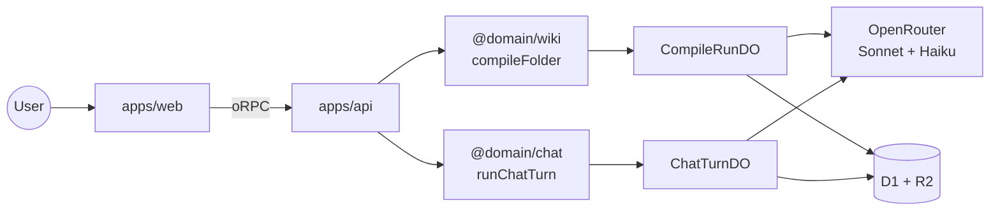
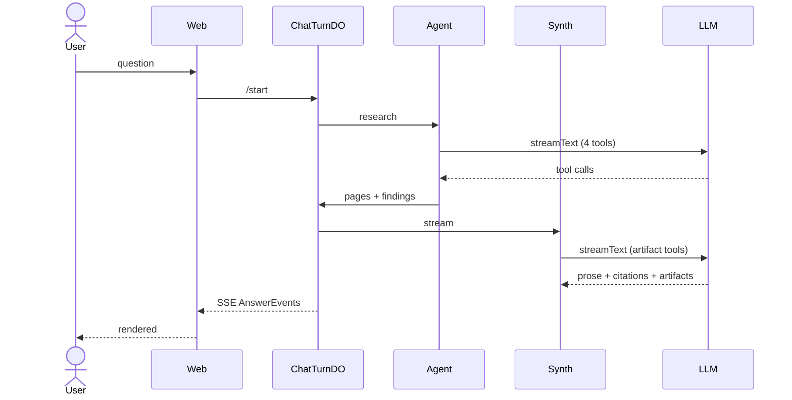

# Tenex — what it does and how it works

A scroll-through of the system. Each section opens with a short
plain-English context paragraph, then the diagrams and code from
that part of the codebase, with a short "what you're looking at" note
under each block. File paths are deep-linked to the exact line on
GitHub. For the full reference, see
[`code-tour.md`](./code-tour.md) and
[`perspective-flow.md`](./perspective-flow.md).

---

# The bet

Most search tools take your query and run it against a generic index
of the document — same index for everyone. **Tenex flips that.**
Before you index a single file, you tell the system what you're
trying to *get out of* the corpus — a "perspective." The wiki gets
built around that point of view.

The analogy is three readers of the same book — a screenwriter, a
philosopher, a linguist — sitting in three different chairs. Same
source text, three radically different sets of notes. The
screenwriter wants characters and scenes; the philosopher wants
ideas about power and language; the linguist wants etymology.

The technical version of the bet: **move the agent loop upstream**.
Instead of having an AI agent figure out your perspective every time
you ask a question (slow, repetitive, expensive), do that
interpretation work once at ingest time. The resulting wiki has the
lens already baked in, so chat questions can be cheap and the answers
go deeper.

Concretely — a music corpus compiled under "business opportunities"
should produce sections named **Opportunity / Pain / Wedge**, not
Tool / Topic / Concept. That's the test of whether the perspective
actually landed.

The perspective is just free-form text the user picks (or writes)
before compile starts. Below is one of the bundled presets — every
preset is editable, so the user can see and tune exactly what the
model will be told.

📄 [`apps/web/src/lib/perspective-presets.ts:37`](../../apps/web/src/lib/perspective-presets.ts#L37)

```ts
export const PERSPECTIVE_PRESETS = [
  {
    id: 'business-opportunities',
    label: 'Business opportunities',
    prompt: `Read this corpus as a founder hunting for a business to
start, fund, or expand.

Naming conventions (use these — they shape every page):
- PageType names: prefer Opportunity, Pain, Customer, Channel,
  Competitor, Trend, Wedge, Risk. Reject generic "Topic" / "Concept".
- Page titles: name the finding, not the topic.
  "AP teams pay $40K/yr for invoice OCR" beats "Invoice software".
- One sharp opportunity per page, sized and risked.`,
  },
  // novel-writing · engineering-decisions · research-synthesis · custom
];
```

> **What you're looking at:** the literal text the AI sees. There's
> nothing magic in our prompt — the user types instructions, we
> attach them to every model call during compile. The presets are
> just well-tuned starting points the user can edit.

---

# System architecture

The system is a React frontend talking to a backend that runs on
Cloudflare Workers (a serverless edge runtime). The frontend and
backend share their API definitions through a library called **oRPC**
— you write the contract once using Zod schemas, and both sides get
matching types. No drift between frontend and backend.

The codebase is **domain-driven**: instead of one giant `src/`
folder, the system is split into "bounded contexts" — `ingestion`,
`wiki`, `chat`, `verification` — each in its own package with its
own vocabulary. The chat code can't reach into the wiki code's
internals; they communicate only through the shared contracts. Each
context has its own glossary file enforcing the language.

From the frontend, the user can do two things: **compile** a folder
into a wiki, or **chat** with an already-compiled wiki. Both paths
involve work that can take a few minutes (LLM calls, multi-stage
pipelines). To survive that — Cloudflare Workers normally die after
30 seconds — we route both flows through **Durable Objects**, a
Cloudflare construct that hosts long-running state and outlives any
single HTTP request.



> **What you're looking at:** the flow of a request through the
> system. The user hits the React app; the React app calls the API;
> the API delegates to one of the bounded contexts; the slow work
> happens inside a Durable Object; everything reads and writes to
> Cloudflare's D1 (SQL) and R2 (blob storage).

```
packages/
  contracts/                 # @package/contracts (oRPC + Zod)
  shared-kernel/
  domains/
    ingestion/               # Drive → R2/D1
    wiki/                    # compile pipeline
    chat/                    # agent + synth
    verification/            # claim audits
```

> **What you're looking at:** the folder layout. Each domain package
> owns its own vocabulary and never imports from another domain. The
> contracts package is the shared seam they all communicate through.

---

# The compile pipeline

Compile is the work of turning a folder of source documents (PDFs,
Google Docs, etc.) into a typed, cross-linked wiki shaped by the
user's perspective. It's **five LLM-backed stages** that run one
after another inside a Durable Object. The DO holds the per-run
event stream so the live "what's happening right now" UI updates
flow to the frontend as the work progresses.

We use multiple smaller LLM calls instead of one big one because each
stage has a different shape of output (structured schema vs. prose
vs. lists of citations), and we want to use a cheaper model where we
can — only the schema and drafter stages need Sonnet quality; the
rest run on Haiku.


What each stage does:

- **SchemaInferrer** reads the first few sources and picks the
  *sections* of the wiki — what we call "PageTypes." Under a
  perspective, this is where Opportunity / Pain / Wedge gets named
  instead of generic Tool / Topic.
- **Planner** looks at every source and decides which sections each
  one belongs in. Under a perspective, it deliberately assigns each
  source to *multiple* sections — so one document about a software
  tool produces Opportunity findings AND Pain findings AND Wedge
  findings.
- **Researcher** reads each source and extracts verbatim quotes
  along with their exact byte position in the source. Those byte
  positions matter — they become "citations" the synthesizer will
  later rely on to prove its claims.
- **Drafter** writes one magazine-quality page per cluster of related
  findings (e.g. all findings about the same opportunity become one
  page).
- **Linker + Index + Narrator** resolves `[[wiki-links]]` between
  pages, generates one table-of-contents page per section, and writes
  an opinionated thesis + glossary for the whole wiki.

The orchestrator passes the user's perspective into every stage:

📄 [`compile-folder.ts:147` `compileFolder`](../../packages/domains/wiki/src/application/compile-folder.ts#L147)

```ts
export async function compileFolder(deps, input) {
  const { schema } = await inferSchema(
    { llm: deps.llm },
    { sources: headTexts, perspective: input.perspective },
  );
  const { tasks } = await planCompile(
    { llm: deps.llm },
    { schema, sources, perspective: input.perspective },
  );
  const { findings } = await researchSource(
    { llm: deps.llm },
    { source, pageTypes, perspective: input.perspective },
  );
  const { draft } = await draftPage(
    { llm: deps.llm },
    { pageType, findings, perspective: input.perspective },
  );
  // ...resolveBacklinks → buildIndexes → narrateIndexes
}
```

> **What you're looking at:** every call to a stage gets the same
> `perspective` string passed in. Each stage takes it from there. The
> orchestrator's only job is to chain them in order and pass the
> output of one into the next.

---

# Perspective enforcement

The hard part isn't *passing* the perspective into each stage — it's
making the model actually *use* it. A naive prompt like "bias toward
this perspective" doesn't work. The model reads the corpus and quickly
notices it's about music or AI safety or whatever, then snaps back to
producing sections that fit *the content's* natural shape, not the
user's lens.

We force the issue with three layers:

1. A **HARD CONSTRAINT preamble** that opens every system prompt —
   blunt rules like "generic alternatives are failures."
2. A **stage-specific clause** that names the failure mode for that
   particular stage (the schema clause is the most aggressive,
   because schema choices cascade everywhere).
3. A **one-line reminder** prepended to every user message. The
   system prompt sets the rules; restating them on the user side
   makes it stick. Repetition through both channels is the most
   reliable enforcement we have short of fine-tuning.

One helper wraps every stage's system prompt:

📄 [`perspective-preamble.ts:138` `withPerspective`](../../packages/domains/wiki/src/application/perspective-preamble.ts#L138)

```ts
export const withPerspective = (systemPrompt, perspective, { stage }) => {
  if (!perspective) return systemPrompt;
  return `========================================================
PERSPECTIVE (load-bearing — read first, apply throughout):

${perspective}

--------------------------------------------------------
${UNIVERSAL_ENFORCEMENT}
${STAGE_DIRECTIVES[stage]}
========================================================

${systemPrompt}`;
};
```

> **What you're looking at:** a tiny wrapper function. Every stage's
> system prompt gets routed through it before going to the model.
> Inside the giant `=====` block is the user's perspective text, the
> universal rules, and the stage-specific clause. After the block,
> the stage's original prompt follows untouched.

The universal rules — same text in front of every stage's prompt:

```
This perspective is a HARD CONSTRAINT, not a soft suggestion.

1. Every PageType name, page title, section heading must read as if a
   perspective-holder wrote it. Generic alternatives are failures.
2. Rank what to include by the perspective's priorities.
3. Frame every finding around its IMPLICATION under the perspective.
4. If you catch yourself producing output that could come from any
   wiki of any corpus on any topic, STOP and re-anchor.
   Generic = wrong.
5. Structural rules in the prompt below always win.
```

> **What you're looking at:** the literal instructions the model
> sees. Note rule 5 — the perspective can reshape WHAT we say, but
> never break things like "every citation must include a byte range."
> Lens > corpus shape, but structure always wins.

The stage-specific clause for the SchemaInferrer — the one that
prevents the most common failure (a music corpus compiled under
"business" still producing Tool/Topic/Concept):

📄 [`perspective-preamble.ts:12` `STAGE_DIRECTIVES.schema`](../../packages/domains/wiki/src/application/perspective-preamble.ts#L12)

```
STAGE: SchemaInferrer
You are about to name the PageTypes for this wiki. These names
cascade through every downstream step.

- A business-opportunities perspective on a corpus of music tutorials
  should yield PageTypes like Opportunity / Pain / Wedge — NOT Tool /
  Topic / Resource — even though the corpus is "about" music.
- THE USER PICKED THE PERSPECTIVE PRECISELY TO RESHAPE THE CORPUS —
  honor that choice.
- REJECT generic catch-all names unless the perspective endorses them.
```

> **What you're looking at:** the in-prompt example tells the model
> exactly the wrong answer to avoid. Concrete examples (with caps for
> emphasis) work better than abstract rules for prompt steering.

---

# The chat agent

When a user asks a question of a compiled wiki, we run what's called
an **agent loop**. Instead of one model call that tries to answer
everything, we give the model a set of *tools* — small functions like
"search the wiki" or "fetch a page" — and let it call them in
whatever order makes sense for the question. It runs multiple model
turns: think → call a tool → see the result → think again → call
another tool → etc. The model decides what's next. That's what makes
this an **agent** rather than a fixed retrieve-then-answer pipeline.

The whole loop runs inside a per-turn Durable Object — same idea as
the compile DO. Because the user's `chat.ask` call and the
`chat.streamAnswer` call that follows might land on different Worker
isolates (Cloudflare doesn't guarantee they share state), the DO is
the single addressable place that holds the per-turn event stream.



> **What you're looking at:** the order of operations for one chat
> question. The agent does the research; the synthesizer composes
> the answer. Both stream their progress back through the DO to the
> frontend as Server-Sent Events.

The agent has four tools to choose from:

- **`listPagesByType`** — browse a whole section of the wiki by name.
  Used when the user's question maps to one of the section names
  (e.g. asking about "business ideas" → enumerate everything in the
  `Opportunity` section).
- **`searchWiki`** — keyword search across page titles and bodies.
  Standard fuzzy lookup.
- **`readWikiPage`** — fetch one page's full body and citations by id.
- **`searchSources`** — keyword search through the *original source
  documents* (the PDFs the wiki was compiled from). Used when the
  compiled-page vocabulary doesn't match the user's words.

📄 [`agentic-researcher.ts:170` `createAgenticResearcher`](../../packages/domains/chat/src/infrastructure/agentic-researcher.ts#L170)

```ts
const result = streamText({
  model: opts.model,
  tools,                              // 4 tools below
  toolChoice: 'auto',                 // model picks which + when
  stopWhen: stepCountIs(opts.maxSteps ?? 8),
  system: buildSystem(meta),          // injects wiki taxonomy
  prompt: `Question: ${input.question}`,
});
```

> **What you're looking at:** this is the entire agent loop, six
> lines from the Vercel AI SDK. `streamText` keeps calling the model
> with the tool results until either the model says "I'm done" or
> we hit our step cap of 8. `toolChoice: 'auto'` means the model
> decides which tool to call — we're not orchestrating; we're
> dispatching.

📄 [`agentic-researcher.ts:289` `listPagesByType`](../../packages/domains/chat/src/infrastructure/agentic-researcher.ts#L289)

```ts
listPagesByType: tool({
  description:
    "Enumerate every Concept page in the wiki under a given " +
    "PageType. Use this when the user's question maps to one of " +
    "the PageType names in the wiki's taxonomy — e.g. 'business " +
    "ideas' → 'Opportunity'.",
  inputSchema: z.object({ pageType: z.string() }),
  execute: async ({ pageType }) => {
    const hits = await opts.wikiReader.listPagesByType({
      wikiId: input.wikiId, pageType, limit: TYPE_LIST_LIMIT,
    });
    for (const p of hits) noteVisit(p);
    return { count: hits.length, pages: hits.map(/* title + snippet */) };
  },
}),
```

> **What you're looking at:** one of the four tools. The
> `description` is what the model reads to decide whether to call
> this tool — written for the AI, not for engineers. The
> `inputSchema` is the Zod shape the model has to fill in. `execute`
> is the actual function that runs when the model calls the tool.

---

# The synthesizer

Once the agent has gathered the relevant pages, the **synthesizer**
composes the final answer. It's a separate model call with a
different set of tools — this time, **eight typed visual artifact
kinds**: ComparisonTable, Timeline, KeyMetric, Quote, LineChart,
BarChart, CodeBlock, Markdown. The model picks the right artifact
for each chunk of the answer, so a "compare X and Y" question
renders as an actual comparison table component (not bulleted
prose), and a "what's the key number?" question renders as a big
metric card.

We also stream the model's partial work back as live "thinking" text
in the UI. As it's typing out the JSON for a comparison table, you
see "Adding columns: model, training data, …" appear in the chat —
just enough movement that the user knows it's working.

📄 [`ai-sdk-synthesizer.ts:28` `buildArtifactTools`](../../packages/domains/chat/src/infrastructure/ai-sdk-synthesizer.ts#L28)

```ts
const buildArtifactTools = () => ({
  ComparisonTable: tool({
    description: 'Use when comparing two or more items side-by-side.',
    inputSchema: z.object({
      columns: z.array(z.string()),
      rows: z.array(z.object({ cells: z.array(/* value, citationId */) })),
      citationIds,
    }),
    execute: async (input) => input,
  }),
  Timeline:   tool({ /* { events: [{ at, label, description }] } */ }),
  KeyMetric:  tool({ /* { label, value, delta, trend } */ }),
  Quote:      tool({ /* { text, attribution } */ }),
  LineChart:  tool({ /* { xLabel, yLabel, series } */ }),
  BarChart:   tool({ /* { xLabel, yLabel, bars } */ }),
  CodeBlock:  tool({ /* { language, source } */ }),
  Markdown:   tool({ /* { body } */ }),
});
```

> **What you're looking at:** the eight artifact "tools." Each one's
> `inputSchema` defines a specific React component's props. When the
> synth picks `ComparisonTable`, the model is forced to emit
> `columns` and `rows` in that exact shape — we then render the
> typed component directly. No prose-to-table parsing.

---

# Citation grounding

Every factual claim the synthesizer makes has to be backed by a
verifiable citation pointing into the original source. The way it
works: the synthesizer writes prose with `[[cite:UUID]]` markers
inline (e.g. *"AP teams pay $40K/yr for invoice OCR [[cite:abc-…]]"*).
Each UUID maps to a Citation record that has a `sourceId`, a byte
range into the source text, and a **hash of those exact bytes**.

Before any answer reaches the user, we re-hash the source bytes at
that byte range and compare to the stored hash. If they don't match,
the turn aborts with a "citation tripwire" error. A model can't
invent a quote without also inventing a byte range that hashes the
same — and the source hashes are computed by our code at compile
time, not by the model. **Fabrication is structurally impossible.**

📄 [`synthesize-answer.ts:222` `verify`](../../packages/domains/chat/src/application/synthesize-answer.ts#L222)

```ts
const verify = async (c: Citation): Promise<void> => {
  const v = await deps.sourceHashes.verify(c);    // re-hash source bytes
  if (!v.ok) {
    throw new CitationTripwireError(
      `Citation ${c.id} failed hash check: ${v.reason}`,
    );
  }
};
```

> **What you're looking at:** the reader side of the contract. Every
> citation goes through `verify` before the answer reaches the user.
> A throw aborts the whole turn — we'd rather show no answer than a
> fabricated one.

The other half — the writer side. When the compile pipeline binds a
citation to a drafted page, it computes the hash of the exact byte
slice. That hash gets persisted into D1 alongside the citation.

📄 [`compile-folder.ts:135` `sliceHash`](../../packages/domains/wiki/src/application/compile-folder.ts#L135)

```ts
const sliceHash = async (text, start, end) => {
  const slice = text.slice(start, end);
  const bytes = new TextEncoder().encode(slice);
  const buf = await crypto.subtle.digest('SHA-256', bytes);
  return `sha256:${toHex(buf)}` as ContentHash;
};
```

> **What you're looking at:** a SHA-256 hash of the exact bytes the
> citation covers. The verifier at chat time runs the same function
> on the same byte range and compares. Cryptographic guarantee that
> the bytes haven't been tampered with — and since the AI never sees
> the hash, it can't fake one that matches.

---

# Where to go deeper

- [`code-tour.md`](./code-tour.md) — every section, every helper,
  every interesting bug we hit along the way
- [`perspective-flow.md`](./perspective-flow.md) — perspective
  threading diagrammed step by step
- `/present` — the non-technical 14-slide deck for the story side
