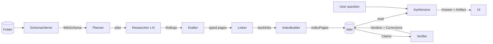

# folder-wiki — design spec

**Status:** Approved (brainstorming complete; awaiting `superpowers:writing-plans`)
**Owner:** tonyvantur
**Date:** 2026-05-09
**Authored via:** `superpowers:brainstorming`
**Project doc:** [`docs/projects/0002-folder-wiki.md`](../0002-folder-wiki.md)
**Storyboard:** [`storyboard.md`](storyboard.md)
**Bounded context glossaries:** [`@domain/ingestion`](../../../packages/domains/ingestion/glossary.md) · [`@domain/wiki`](../../../packages/domains/wiki/glossary.md) · [`@domain/chat`](../../../packages/domains/chat/glossary.md) · [`@domain/verification`](../../../packages/domains/verification/glossary.md)

This spec is the **canonical conceptual design**. The slice plan with dependencies, risks, and the project lifecycle lives in `0002-folder-wiki.md` (per the repo's `docs/projects/_template.md` convention). The video plan lives in `storyboard.md`. The per-context vocabulary lives in each context's `packages/domains/<ctx>/glossary.md`.

## Table of contents

- [1. Integrated product vision](#1-integrated-product-vision)
- [2. Bounded contexts and agent topology](#2-bounded-contexts-and-agent-topology)
- [3. Architecture topology](#3-architecture-topology)
- [4. UI design system](#4-ui-design-system)
- [5. Risks and deliberate non-specifications](#5-risks-and-deliberate-non-specifications)
- [Appendix A. Open questions resolved](#appendix-a-open-questions-resolved)
- [Appendix B. Brainstorm answers](#appendix-b-brainstorm-answers)
- [Appendix C. Related memory and conventions](#appendix-c-related-memory-and-conventions)

---

## 1. Integrated product vision

**Product.** Compile a Folder into an LLM Wiki. Connect a Drive folder; the agent inspects your documents, generates a domain-specific wiki schema, compiles every doc into typed wiki pages with auto-generated indexes, and lets you chat against the synthesized knowledge with adaptive UI per question. A verifier audits every claim against the original source spans.

**Three creative leaps**, each addressing a distinct trust problem in knowledge work:

| Leap | What it does | Trust problem solved |
|---|---|---|
| **Adaptive wiki schema** | Your wiki's *shape* adapts to your domain. PageTypes and Relations are generated per folder. | "Generic concept pages don't match how my team actually thinks." |
| **Generative artifact answers** | Your answers' *UI* adapts to the question — tables, timelines, charts, mini-apps. | "Wall-of-text answers are hard to act on." |
| **Span-verifying lint loop** | Every claim is provably grounded. Different model audits Claims against Spans; flags + fixes mismatches. | "I can't trust LLM-summarized knowledge — what if it's wrong?" |

**Client promise (one sentence):** Knowledge you can trust — shaped to your domain, retrieved adaptively, verified continuously.

**What it isn't.** Not a chat-with-RAG product (the wiki *is* the index). Not a Notion clone (the wiki is generated, typed, and verified). Not a vector database product (no embeddings; agentic search reads the wiki). Not a generic LLM tool (it has opinions about how knowledge should be shaped per domain).

**Reference / inspiration.** Andrej Karpathy's [LLM-Wiki gist (April 2026)](https://gist.github.com/karpathy/442a6bf555914893e9891c11519de94f). Our extensions over the gist: typed schemas (not generic markdown), generative artifact answers (not prose-only), span-verified lint loop with corrections (the documented critique addressed in production).

---

## 2. Bounded contexts and agent topology

### 2.1 Four packages, four vocabularies

Cross-domain imports are illegal; coordination via `@package/contracts` (sync) or domain events through `@package/shared-kernel` (async).

| Context | Aggregate root | New terms (third-leap additions in **bold**) |
|---|---|---|
| **ingestion** | `Source` (immutable per content hash) | — |
| **wiki** | `Wiki` | **`WikiSchema`**, **`PageType`**, **`Relation`**, **`IndexPage`** (new WikiPage subtype alongside Concept / Summary / Answer) |
| **chat** | `Conversation` | **`Artifact`** (third `AnswerSegment` kind alongside prose and citation) |
| **verification** | `LintRun` | — |

Vocabulary now lives in `packages/domains/<ctx>/glossary.md` + `.cspell/glossary.txt`, enforced by cspell with `addWords: false` per the project's linguistic-DDD discipline.

### 2.2 Shared types at the contracts seam

```
Span        (source_id, byte_range, content_hash)         — owned by ingestion
Citation    (span, label)                                 — owned by wiki
Claim       (wiki_page_id, paragraph_id, claim_text)      — owned by wiki
WikiSchema  (page_types[], relations[])                   — owned by wiki
Artifact    (component_name, props, citations[])          — owned by chat
AnswerSegment  prose | citation | artifact                — owned by chat
```

Implemented as Zod schemas in `@package/contracts`, re-exported by each context's contract module.

### 2.3 Domain events (the only legal cross-context wire)

```
ingestion ── SourceIngested ───────▶ wiki                (triggers SummaryPage compile for that Source)
wiki      ── SchemaInferred ───────▶ (UI; informational; surfaces in compile theater)
wiki      ── CompileFinished ──────▶ verification        (auto-triggers a full LintRun)
chat      ── AnswerProduced ───────▶ wiki                (may file as AnswerPage if user opts in)
verification ── CorrectionAccepted ─▶ wiki               (applies the Correction to the WikiPage)
```

### 2.4 Agent topology



| Agent | Role | Model (initial pick) |
|---|---|---|
| **SchemaInferrer** | Reads first 5–10 Sources, declares `WikiSchema` (PageTypes + Relations). New for the third leap. | Sonnet 4.6 |
| **Planner** | Decomposes a CompileRun into per-Source tasks against the schema. | Haiku 4.5 |
| **Researcher** (× N) | Per-Source investigation; emits typed findings keyed by PageType. | Haiku 4.5 |
| **Drafter** | Composes typed `ConceptPage` and `SummaryPage` markdown from findings. | Sonnet 4.6 |
| **Linker** | Resolves `Backlink`s using the `WikiSchema`'s Relations. | Haiku 4.5 |
| **IndexBuilder** | Generates one `IndexPage` per `PageType`. | Haiku 4.5 |
| **Synthesizer** | Reads the wiki, composes `Answer` with prose + citations + chosen `Artifact`. | Sonnet 4.6 |
| **Verifier** | Audits each Claim against its cited Spans; emits `Verdict` + Correction. | **Opus 4.7** — different family from Sonnet to defeat self-grading bias |

**Why six agents not one.** Each has a single coherent job, falsifiable output, and a model pick matched to its difficulty. This is contract-first DDD applied to agents themselves: each is an interface; each is independently testable on a fixture; each can run in parallel with peers when its inputs are ready.

**Why Verifier on Opus.** It must catch errors the Sonnet-driven Drafter and Synthesizer make. Same family auditing same family is the canonical "self-grader" failure mode in 2026 evals literature; using a different family is the cheap, demonstrably-effective fix.

---

## 3. Architecture topology

### 3.1 Compute (Cloudflare Workers + Durable Objects)

| Surface | Where it runs | Why |
|---|---|---|
| oRPC procedures (CRUD, queries, kickoffs) | Hono on Workers | Per existing scaffold; <30s requests |
| Compile (multi-minute) | `CompileRunDO` per run | Survives the 30s Workers wallclock; fans out SSE; resumable |
| Chat streaming | `ConversationDO` per conversation | WebSocket for streaming `AnswerSegment`s; per-conversation state |
| Lint pass | `LintRunDO` per run | Long-running multi-Claim audit; SSE for live overlay |
| Scheduled lint | Cloudflare Cron Trigger | Daily sampling pass on existing wikis |

`SchemaInferrer` runs as the first step inside `CompileRunDO`, before fanning out Researchers.

### 3.2 Storage

```
D1 (relational metadata)
  sources         id, folder_id, drive_file_id, content_hash, mime, filename, page_count, fetched_at
  folders         id, user_id, drive_folder_id, name, last_compiled_at
  wikis           id, folder_id, schema_json, created_at, updated_at      -- schema_json = WikiSchema
  wiki_pages      id, wiki_id, subtype, page_type, slug, title, body_r2_key, ...
  backlinks       from_page_id, to_page_id, relation_name
  claims          id, wiki_page_id, paragraph_id, claim_text, position
  citations       id, claim_id, source_id, byte_range_start, byte_range_end, content_hash, label
  compile_runs    id, folder_id, status, started_at, ended_at, schema_inferred_at
  conversations   id, wiki_id, user_id, created_at
  turns           id, conversation_id, question_text, answer_segments_json, created_at
  lint_runs       id, wiki_id, status, started_at, ended_at
  lint_findings   id, lint_run_id, claim_id, verdict, evidence_text, correction_json
  oauth_tokens    user_id, provider, encrypted_refresh_token, encrypted_access_token, expires_at

R2 (binary blobs)
  sources/{source_id}/raw                           original bytes (PDF/Doc/Sheet)
  sources/{source_id}/text                          extracted plain text
  sources/{source_id}/pages/{page_num}.png          rendered pages for PDF.js
  sources/{source_id}/outline.json                  structural outline
  wiki_pages/{wiki_page_id}.md                      markdown body

KV (cache)
  compile_run:{run_id}:state         TTL 1h     SSE fan-out scratch
  drive_folder:{folder_id}:listing   TTL 5m     Drive folder browse cache
  oauth_state:{state}                TTL 10m    OAuth CSRF state

NOT USED: Vectorize, embeddings, full-text search index.
  Agentic search reads the wiki directly. ~100-doc context-fit ceiling
  acknowledged in trade-offs (production hybrid would add embeddings as
  a fallback retrieval substrate).
```

### 3.3 Streaming protocol

| Procedure | Transport | Why |
|---|---|---|
| `wiki.streamCompileEvents` | SSE | One-way; reconnect-on-drop; survives Workers limits via DO |
| `chat.openConversation` → WS upgrade | Durable Object WebSocket | Bidirectional; user can ask follow-ups mid-stream; per-conversation state |
| `verification.streamLintEvents` | SSE | Same shape as compile events |
| Everything else | Plain JSON over oRPC | Standard request/response |

### 3.4 Citation rendering pipeline

```
User clicks a CitationChip in an AnswerSegment
  ↓
Frontend has the citation { span: { source_id, byte_range, content_hash }, label }
  ↓
Frontend resolves span.byte_range → page_num + bounding_box via cached source.outline.json
  ↓
Frontend requests R2 signed URL: sources/{source_id}/pages/{page_num}.png
  ↓
Modal opens; the chip "flies" (Framer Motion shared layout id) into the modal position
  ↓
PDF page image renders; overlay rect highlights bounding_box; soft glow + label tooltip
  ↓
User can scroll, but the overlay stays anchored to the byte-range coords
```

The flight animation is `motion.div` with `layoutId={citation.id}` shared between the chip and the modal. CSS-only fallback if `prefers-reduced-motion`.

### 3.5 Lint loop architecture

- **Trigger.** Subscribes to `CompileFinished` for an automatic full pass after every CompileRun. Manual trigger via `verification.lintWiki(wikiId)`. Daily Cron Trigger for a sampling pass on existing wikis.
- **Cadence.** Auto = exhaustive on every Claim after compile. Cron = random 10% sample per day.
- **Per-Claim algorithm:**
  1. Extract Claim text from its paragraph in the WikiPage body
  2. For each Citation: fetch the cited byte_range slice from `sources/{source_id}/text` in R2
  3. Send `{ claim_text, cited_spans[] }` to Verifier (Opus 4.7) with a structured-output schema returning `{ verdict, evidence_text, correction? }`
  4. Persist `LintFinding`; emit lint event via SSE for live overlay
  5. If `verdict !== 'supported'`, surface ribbon overlay on the WikiPage

**Concurrency.** Per-Claim verification is independent → concurrent fan-out within the LintRunDO. Cap at 6 concurrent Verifier calls (Workers paid-plan subrequest limit).

---

## 4. UI design system

### 4.1 Stack

| Concern | Library | Why |
|---|---|---|
| Component primitives | `shadcn/ui` (Radix-based) | We own the code; copy-and-customize; fits the Anthropic / Linear bar |
| Styling | `Tailwind CSS` | Utility-first; small bundle; fast iteration |
| Motion | `Framer Motion` | `layoutId` shared transitions for citation flight + compile theater |
| Markdown rendering | `react-markdown` + remark plugins | Magazine-grade WikiPage layout |
| PDF preview | `pdfjs-dist` (PDF.js) | Span-anchored highlight overlay |
| Charts in Artifacts | `Recharts` | Simple, declarative, fits the constrained-artifact protocol |
| Code blocks in Artifacts | `Shiki` | Server-side syntax highlighting |
| Virtualization | `@tanstack/react-virtual` | Large IndexPage lists if needed |

### 4.2 Tokens

```
colors
  neutral       slate-50 → slate-950
  accent        amber-50 → amber-700        (citations, schema chips)
  verdict
    supported   emerald-500
    unsupported amber-500
    contradicted rose-500

typography
  serif         Crimson Pro                  (WikiPage body — magazine feel)
  sans          Inter                        (UI, headings, controls)
  mono          JetBrains Mono               (code in artifacts, schema chips)

spacing            8px grid

motion
  default        200ms ease-out
  citation-flight 400ms spring(0.7, 0.9)
  compile-card    spring(0.6, 0.8) per card travel
```

### 4.3 The six spectacular elements

1. **Magazine-quality WikiPages.** Asymmetric grid: 60ch serif body + 280px sidebar (citations as side-pulls + reading-time + last-verified badge). Pulled-quote component for emphasized claims. SourceLink mini-thumbnail for SummaryPage references.
2. **Compile theater.** Three vertical lanes (`Sources` / `Agents` / `Pages`). Source cards fly across with `layoutId`; agent lanes show progress + current source name; emerging WikiPages pulse-in on the right. SchemaInferred banner pins to the top with the schema chips animating in first.
3. **Citation flight.** `<motion.div layoutId={citation.id}>` on both the chip and the modal anchor. On click: chip → modal position, modal materializes around it. Reverse on close. Falls back to fade if `prefers-reduced-motion`.
4. **Generative artifact answers.** Closed component registry — Synthesizer can only emit `ComparisonTable | Timeline | LineChart | BarChart | KeyMetric | CodeBlock | Quote | Markdown`. Each component takes typed props + a `citations: Citation[]` array. Streaming: AnswerSegments arrive in order; prose and artifacts interleave. Synthesizer's structured-output schema enforces the registry.
5. **Lint-finding overlay.** Ribbon anchored to the Claim's paragraph. Two-pane: `Claim text | Cited Span verbatim`. Below: Correction inline-diff (red strikethrough + green underline). "Apply" pulls the Correction into the WikiPage with a satisfying merge animation; ribbon dismisses.
6. **Span shimmer.** Hovering an AnswerSegment subtly underlines the cited Spans inside the prose with a wavy amber underline; pulses once on hover-in. CSS-only with `text-decoration: underline wavy` + `@keyframes shimmer`.

### 4.4 States

Every state is named, designed, and screenshot-grade. No half-built surfaces.

- **Empty.** Hero asking for a Drive folder URL.
- **Compiling.** Compile theater (Moment 1).
- **Loading.** Shimmer skeletons for WikiPages, IndexPages, and chat answers.
- **Error.** Friendly recovery; OAuth and Drive errors get distinct copy.
- **No-results.** Search/browse empty states with actionable next steps.

---

## 5. Risks and deliberate non-specifications

### 5.1 Risks specific to the integrated design

| Risk | Likelihood | Impact | Mitigation |
|---|---|---|---|
| Phase-0 contract miss → Phase-2 tracks block on each other | Medium | High | Authored together; not delegated. Mock fixtures prove contracts before implementations begin. |
| `SchemaInferrer` produces a generic schema on a mixed folder | Medium | Medium | Demo folder curated for a clear domain (board governance bet). Fallback: surface schema for user edit, persist as override. |
| Verifier on Opus too expensive at scale | Low | Medium | Lint passes are sampling-mode for production cron; full passes only after Compile (rate-limited). |
| Generative artifact answers visually break for unexpected props | Medium | High (visual) | Closed component registry; structured-output schema rejects malformed Artifact emissions; fallback to `Markdown` component on parse error. |
| Citation flight animation hitches on first PDF.js load | Medium | Low (cosmetic) | Pre-warm PDF.js worker on app load; cache page images in R2. |
| `Span` byte_range drift if Source extraction changes | Low | High (lint breaks) | Span identity is content_hash–rooted; re-extract triggers new Spans, never updates existing ones. |
| Durable Object connection limits at peak chat concurrency | Low (single-user demo) | Low | Acknowledged in trade-offs section; production needs DO sharding. |
| oRPC SSE timeout in Workers | Low | Medium | Compile + Lint streams flow through DOs (which can hibernate); Workers SSE only for short-lived event subscriptions. |
| Lint loop non-deterministic on planted contradiction | Medium | High (demo) | Pin Verifier model + temperature 0; require ≥10/10 dry-run catches; backup recording. |
| Compile cost at 20 docs blows budget | Low–Medium | Medium | Haiku for high-volume Researcher + Linker + IndexBuilder; Sonnet only for Drafter + Synthesizer + SchemaInferrer; Opus only for Verifier. |
| GSuite Drive scope verification stalls | Low | Medium | Use my dev account's user-tier consent screen; one tester is sufficient for demo. |

### 5.1.1 Risk-spike outcomes (Phase 1.A, 2026-05-09)

Spike branch (`spike/1.A-risk-spike`, never merged) measured the live happy path on a 5-PDF fixture (Berkshire Hathaway shareholder letters 2020–2024). Stack: `googleapis` 144 + OAuth desktop client + `pdfjs-dist` 4.10 + Vercel AI SDK 6 + `@openrouter/ai-sdk-provider` 2.9 routed at `https://openrouter.ai/api`.

| Risk | Outcome | Recommendation |
|---|---|---|
| Drive auth viability | OAuth happy path completed end-to-end with `drive.readonly` scope on dev account; folder list returns under 1 s once the Drive API is enabled on the GCP project. | Ship single-user OAuth in v1. The redirect URI `http://127.0.0.1:8765/callback` works for the desktop / one-shot CLI flow; the deployed app uses `https://api.tenex.localhost/auth/google/callback` (portless) in dev and the Workers domain in prod. |
| Per-doc compile latency (5 PDFs, sequential Drafter + per-claim Verifier ×3 each + 10× planted determinism) | 176.5 s wallclock total: schema 12 s, 5 drafts averaging 16 s each, 30 verify calls averaging 3 s each. | Parallelize Drafter fan-out in 2.A — target <60 s end-to-end on 20 docs. Per-claim Verifier already parallel-safe (no inter-claim dependency). |
| Token cost per 5-PDF compile | $0.6951 total — schema $0.060, 5 drafts $0.124, 25 in-run verifies + 10 planted-determinism verifies $0.511. Per-PDF amortized: $0.139. | Linear scaling forecast for 20 PDFs is ~$2.80, well under the $5 ceiling. Haiku for Researcher / Linker / IndexBuilder in Phase 2.A keeps the marginal cost flat as N grows. |
| Span-citation accuracy through PDF.js extraction | 20 / 20 sampled spans round-tripped exactly (`text.slice(span.start, span.end) === span.text`) across all 5 PDFs. | Reuse the same extractor pattern in 2.A; freeze on `pdfjs-dist` 4.10. The legacy `pdfjs-dist/legacy/build/pdf.mjs` build is what works under Bun. |
| Verifier-on-Opus determinism on planted contradiction | **10 / 10 caught.** Verifier with `claude-opus-4-7` at `temperature: 0` returned `verdict: "contradicted"` on every run of the NRR=110% / cited span says 105% pair. | Pin model + temperature in production. Deviation budget: if Phase-2 monitoring sees fewer than 10/10 on the same probe, widen the cited-text window before changing models. Cost at this rate is ~$0.027 per Verifier call; 1 lint pass over a 20-claim wiki is ~$0.55. |

Implementation notes that propagated forward from the spike (also captured in commit messages on the spike branch):
- The Anthropic SDK's prefill-`{` trick to force JSON output is **rejected by OpenRouter's Opus 4.7 endpoint** (Bedrock returns 400 "Provider returned error"); rely on Vercel AI SDK's `generateObject` instead, which uses tool-call structured output under the hood.
- Bedrock rejects JSON-Schema `minItems`/`maxItems` values other than 0 or 1; encode array length constraints in the prompt + `.refine()` post-validation, not in the Zod schema metadata.
- Phase 2's domain `infrastructure/` layers should adopt Vercel AI SDK + `@openrouter/ai-sdk-provider` rather than raw `@anthropic-ai/sdk` — the spike proves the path and the JSON-parsing failure modes the SDK abstracts away cost real time to debug otherwise.

Raw run output (per-call latency + token + USD table, schema, claims, verdicts) is in `scripts/spike/out/report.md` on the spike branch; the branch itself is deleted post-merge of this append.

### 5.2 What we deliberately did NOT specify (left to the implementer)

- **Per-procedure Zod schemas.** Contract shapes described in prose here; full Zod schemas are a Phase-0 deliverable.
- **Exact PDF.js highlight implementation.** Annotation layer or custom canvas overlay; pick what works on the first three demo PDFs.
- **Concrete `WikiSchema` for each domain.** SchemaInferrer learns from few-shots in the prompt; specific shapes for board / research / legal are emergent.
- **Persistence of in-progress CompileRuns across DO restarts.** Acceptable to lose in-flight work and require a rerun in v1.
- **Multi-user OAuth flow.** Single-user OAuth for demo; production multi-user is a trade-offs slide.
- **Component-by-component design system tokens beyond listed primitives.** Implementer extends Tailwind config as needed.
- **Exact `ConversationDO` sharding strategy.** Single DO per Conversation in v1; production sharding is a trade-offs slide.
- **Detailed test plan beyond invariants per aggregate.** TDD per slice; no upfront test plan beyond the slice "Done when" criteria in `0002-folder-wiki.md`.
- **The exact slice-by-slice file list.** That's the next skill (`writing-plans`) producing per-slice plans.

---

## Appendix A. Open questions resolved

From `0002-folder-wiki.md` Open Questions:

| # | Question | Resolution |
|---|---|---|
| Q1 | Where do `Span` and `Citation` live? | Zod schemas in `@package/contracts`, re-exported by each context's contract module. (See §2.2.) |
| Q2 | Is `chat` its own package? | Yes. `Conversation` aggregate has durable persistence; `Turn` history needs its own model. (See §2.1.) |
| Q3 | Are `AnswerPage`s a `WikiPage` subtype? | Yes — alongside `ConceptPage`, `SummaryPage`, and the new `IndexPage`. Filed via `AnswerProduced` event from chat. (See §2.3.) |
| Q4 | Verifier model selection | **Opus 4.7**. Different family from compile-side Sonnet to defeat self-grading bias. (See §2.4.) |

Q5–Q7 from 0002 (web deploy target, Drive auth, compile latency) remain pending; resolved in Phase 1.

---

## Appendix B. Brainstorm answers

Captured from the `superpowers:brainstorming` session on 2026-05-09:

| Question | Answer |
|---|---|
| Phenomenal axis | All four dimensions (demo theatrics, architectural elegance, design polish, technical depth). Don't trade between them. |
| Time framing | Don't think in weeks/days; ambition over hours. |
| Evaluator | Presented as if pitching to the client. |
| Architecture preference | Contract-first max parallelism; "atomic units integrating in <5 minutes." |
| Design reference | Perplexity / Anthropic Artifacts. |
| Second creative leap | Generative artifact answers (chat answers as React components). |
| Third creative leap | Adaptive wiki schema (typed per domain). |

Saved as project memory: `~/.claude/projects/.../memory/take-home-direction.md`.

---

## Appendix C. Related memory and conventions

- Memory: `take-home-direction.md` — project framing, three leaps, presentation framing, architecture preference, quality bar.
- Memory: `feedback-time-framing.md` — don't time-budget jointly.
- Memory: `rulesync-source-of-truth.md` — `.rulesync/` is the only committed AI-tool config in this repo.
- Conventions: `CLAUDE.md`, `AGENTS.md`, `.claude/memories/{domain-driven, monorepo-discipline, orpc-patterns, secrets}.md`.
- Project rules for working with agents: `docs/ai-tooling/working-with-agents.md`, `docs/ai-tooling/subagents.md`.

---

## Next step

Invoke `superpowers:writing-plans` against this spec to produce per-slice implementation plans. Each plan in Phase 2 (5 slices) should be self-contained enough to be executed by an independent agent against contract mocks defined in Phase 0.
